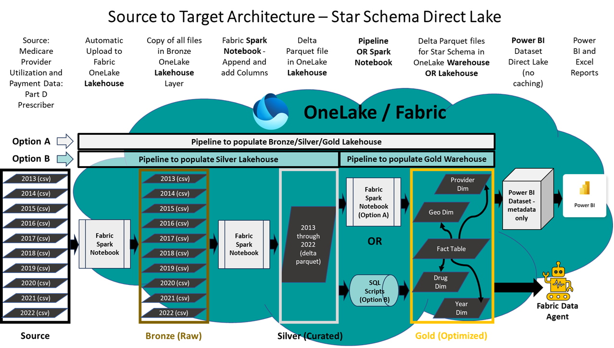

# **Power BI Direct Lake Connector with 275M+ Healthcare Records**

## 🚀 Overview

This solution demonstrates the capabilities of **Microsoft Fabric** using over **275 million rows** of real-world healthcare data. It showcases how to leverage the **Power BI Direct Lake connector** to query large datasets stored in Delta Parquet format—**without caching or a relational database**.

The dataset used is the publicly available [Medicare Part D Prescribers - by Provider and Drug](https://data.cms.gov/provider-summary-by-type-of-service/medicare-part-d-prescribers/medicare-part-d-prescribers-by-provider-and-drug), sourced from the Centers for Medicare & Medicaid Services (CMS).

> 🎥 **Watch the full demo**: YouTube Video https://youtu.be/2tLIGVZ4c8E

---

## 🏗️ Architecture

The solution follows the **Medallion Architecture**:

- **Bronze Layer**: Raw CSV files downloaded from CMS
- **Silver Layer**: Cleaned and flattened Delta Parquet tables
- **Gold Layer**: Star schema tables optimized for Power BI reporting

Additionally, it integrates the **Fabric Data Agent** enabling **Generative AI-powered natural language queries**.

---

## 🧠 What You'll Learn

This demo provides hands-on experience with:

- **Data engineering** using Fabric Spark and Data Pipelines
- **Power BI Direct Lake Mode** for querying large-scale data
- **Medallion Lakehouse Architecture** (Bronze → Silver → Gold)
- **Natural Language querying** using **Fabric Data Agents**

---

## ⚙️ Setup Options

### ✅ Option 1: Quick Setup (Automated)

Ideal for a fast setup with minimal effort. You can run a single Notebook and it will install an end-to-end Fabric medaalion architecture with 275M rows of data for testing, demos and evaluation purposes.

Run a single notebook to set up the full environment with following components deployed:

- Lakehouse
- Notebooks
- Data Factory Pipeline
- Semantic Model
- Power BI Report
- Data Agent

📘 **Setup Guide**: [`quick-setup.md`](./quick-setup.md)

> ⏱️ Requires less than 5 minutes to setup the installation Notebook, followed by approximately 20–45 minutes for a non-interactive Data Factory pipeline to load data. 

> ⚠️ Note: This method currently uses the Lakehouse for all layers (including Gold).

---

### 🛠️ Option 2: Manual Setup (Step-by-Step)

Ideal for hands-on learning and deeper understanding of Microsoft Fabric and Power BI.

Follow the step-by-step instructions to manually set up the solution components:

- **Lakehouse or Warehouse, Notebooks and Data Pipeline** (Warehouse for Gold Layer is an option available in manual setup only) ,this step takes approximately **10–15 minutes**
- **Data Factory pipeline** runs non-interactively to load data which takes about **20–45 minutes**
- **Semantic Model** creation requires additional manual effort and is the most time-intensive part
- A **Power BI report template** is already included to help accelerate report building

📘 **Setup Guide**: [`manual-setup.md`](./manual-setup.md)

> ⏱️ **Total setup time**: ~30–60 minutes depending on experience  
> 💡 **Recommended for**: Users who want to explore the architecture and learn by doing

---

