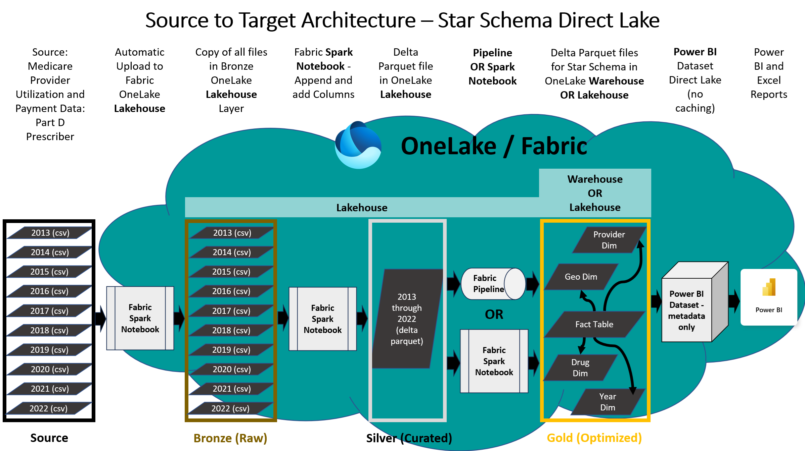

## Updates December 2024
- Added a new component of this module to cover [Fabric AI Skills](https://learn.microsoft.com/en-us/fabric/data-science/concept-ai-skill), which is in Public Preview at the time of publication. The AI Skills component can be deployed in a few minutes once you have completed **Step 2a** or **Step 2b** from the instructions below. The AI Skills demo will enable you to ask natural language queries of the star schema relational model in either the Fabric Lakehouse or Warehouse. The results can be used to both generate insights into the data or to create complex SQL queries. The new AI Skills component is listed as **Step 5** at the bottom of this page. View a video about the AI Skill example and walk through the deployment process at this link: https://youtu.be/ftout8UX4lg 
- Updated instructions and file for the PBIX in this repo. Eliminated some broken code (naming conventions fixed for Prescriber State, Prescriber City State, and Prescriber City columns) and improved deployment instructions.

## Updates October 2024
- Automated the ingestion of CMS Data files directly from CMS Website using metadata json file so no need to download/uplodate data manually. Also now includes the year 2022 data files to increase the total row count to 250 million rows.
- Added an alternate path of using Fabric Warehouse for Gold Layer for the teams who prefer T-SQL skillset for the consumption layer, original version only used Fabric Lakehouse because Power BI Direct Lake Mode was not support at that time but now Fabric Warehouse supports Power BI Direct lake mode.
- Both methods use Fabric Data Factory Pipelines to build out the gold layer ready for report build, once the pipeline is implemented **execution can be kicked off to run non-interactively and make data available in 20 to 45 minutes.**

# Fabric Power BI Direct Lake Connector with 250M Rows

## Scenario
The Fabric Direct Lake connector is a new technology for querying delta parquet files from Power BI without data caching or an intermediary relational database. Power BI datasets have been modernized so that the semantic layer containing metadata and query logic can directly query the Fabric Data Lake. Data for the demo is 250 million rows of real healthcare data from the open data database titled **Medicare Part D Prescribers - by Provider and Drug**. Link here: https://data.cms.gov/provider-summary-by-type-of-service/medicare-part-d-prescribers/medicare-part-d-prescribers-by-provider-and-drug . An end-to-end demo of this solution module can be viewed at this link: https://youtu.be/2tLIGVZ4c8E 

## Scope
This demo is intended to provide experience with data engineering tasks using Fabric Spark and/or Data Pipelines to build out Delta Parquet tables and then use the Direct Lake connector in Power BI to query large volumes of real data. The medallion lakehouse architecture is followed in this sample where raw CSV files are loaded to Bronze Layer, then Silver Layer flat table built using Delta Parquet format and lastly Gold Layer tables serve up the star schema model for a Direct Lake Power BI dataset. 

### Pre-Requisite
Fabric enabled Workspace is the pre-requisite to be able to setup and end to end demonstration in your own environment. The instructions below are combination of Spark Notebook and a few manual steps to create Power BI Dataset and corresponding report.

***

## Steps to setup demo in your own environment

### Step 1: [Create Lakehouse and setup Spark Notebooks](./docs/1-CreateLakehouse-SetupSparkNotebooks.md) 
Click the url above for instructions aon setting up your Lakehouse and importing the Spark Notebooks.

***

### Step 2: Download Raw Files and build out Silver and Gold Layer Tables (Star Schema) to be used for Reporting
**Two methods are documented and available for this step and only one of the two needs to be implemented.** The choice on which method to use is more of a preference based on your skill set. Microsoft Fabric is a broad platform and allows end users to pick tools of their preference hence choice here demonstrates verstaility of the platform. In this step Bronze, Silver and Gold Layers of Medallion architecture are built using slightly different methods, the biggest difference is whether Gold Layer Star Schema Tables to be used for reporting are created in a Lakehouse or a Warehouse. 

**Note**: Fabric Data Factory Pipeline implementation steps are manual for now but we will look into making it easier using automation in future. **Both options 2a and 2b are manual but Step 2a is going to be a little less effort to setup because it uses Spark Notebooks which can be easily imported for use in your Fabric workspace. Step 2b will require little extra effort to setup Pipeline activities for SQL Stored Procedures, but in return the Gold Layer will be in the Fabric Warehouse instead of the Lakehouse (folks from a SQL background may prefer this option).**

**2a. Gold Layer in Fabric Lakehouse** - A Fabric Data Factory Pipeline is implemented to use Spark Notebooks for building out all three layers - Bronze, Silver and Gold Layers in a Fabric Lakehouse. Click the link below for instructions in this GitHub Repo, and you can also watch a video reviewing the 2a process at this link: https://youtu.be/TG03mkJKq4k

**[Setup Pipeline with Gold Layer in Fabric Lakehouse](./docs/2a-SetupPipeline-GoldLayerFabricLakehouse.md)**

Skip to Step 3 if Step 2a was chosen and successfully executed to create star schema tables.

**2b. Gold Layer in Fabric Warehouse** - Fabric Data Factory Pipeline is implemented to use Spark Notebooks for building Bronze and Silver Layers in a Lakehouse but SQL Stored Procedures for building out the final Gold Layer persisted in Fabric Warehouse. A video detailing the creation and deployment of these Stored Procedures can be found at this link: https://youtu.be/G6t4d5FU0zI 

You will need the Lakehouse name from Step 1 and if you used the suggested name **cms_lakehouse** it will be easier otherwise a few edits in T-SQL scripts will be required.

**[Setup Pipeline with Gold Layer in Fabric Warehouse](./docs/2b-SetupPipeline-GoldLayerFabricWarehouse.md)**

***

### Step 3: [Create the Direct Lake Power BI Star Schema Semantic Model with DAX expressions and metadata](./docs/3-CreatePBISemanticModel.md) - Steps are manual at this time but in the future we plan to automate for quick setup.

***

### Step 4: [Create Reports using Power BI or Connect using Excel](./docs/4-CreatePBIReport.md) - Steps are manual at this time but in future plan to automate for quick setup. We do have a .pbix file in this repo that can connect to the Semantic Model if the metadata matches the naming conventions in Step 3.

***

### Step 5: [Create Fabric Data Agent and query from Azure AI Foundry Agent](./docs/5-CreateAISkill.md) - Create a Fabric Data Agent that uses the new star schema design in the Lakehouse or Warehouse. The Data Agent will enable natural language queries with text-to-SQL for your new end-to-end Fabric solution. Optionally, instructions for querying the Fabric Data Agent from an Azure AI Foundry Agent are at the end of this section.

