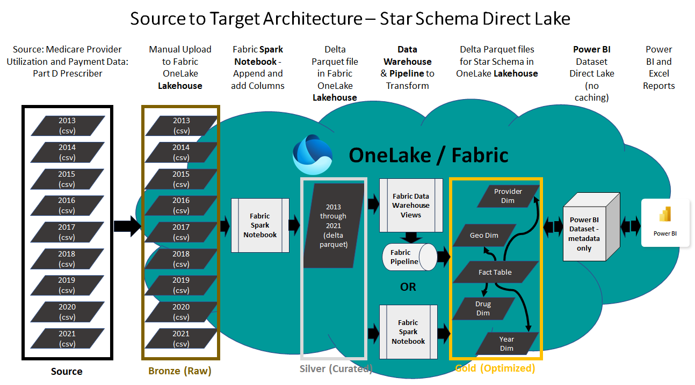
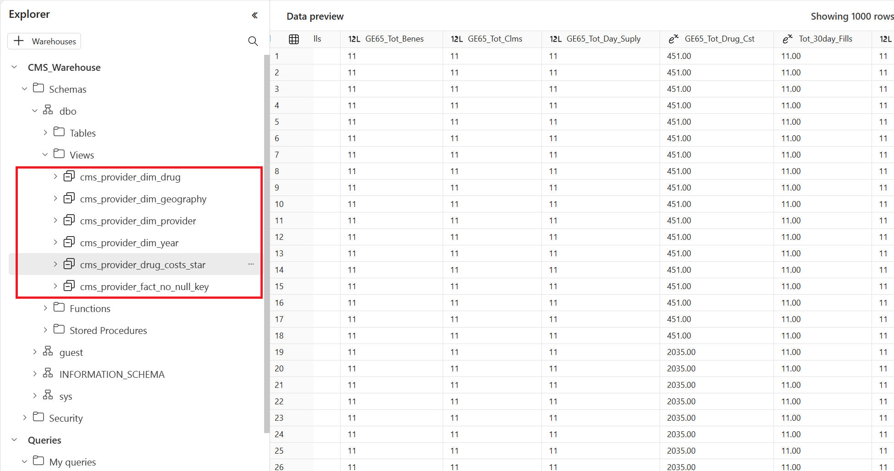
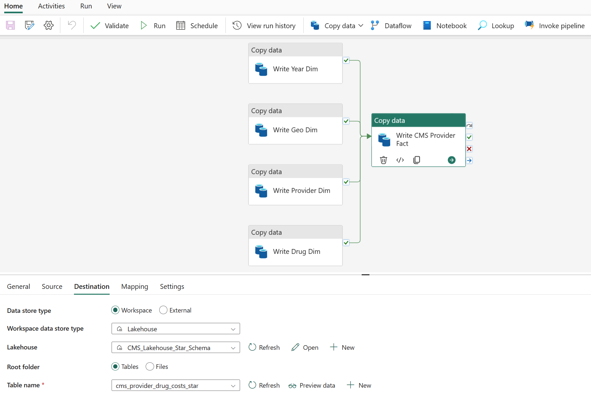

# Fabric Power BI Direct Lake Connector with 220M+ Rows

## Scenario
The Fabric Direct Lake connector is a new technology for querying delta parquet files from Power BI without data caching or an intermediary relational database. Power BI datasets have been modernized so that the semantic layer containing metadata and query logic can directly query the Fabric Data Lake. Data for the demo is 220M+ rows of real healthcare data from the open data database titled **Medicare Part D Prescribers - by Provider and Drug**. Link here: https://data.cms.gov/provider-summary-by-type-of-service/medicare-part-d-prescribers/medicare-part-d-prescribers-by-provider-and-drug . An end-to-end demo of this solution module can be viewed at this link: https://youtu.be/2tLIGVZ4c8E 

## Scope
This demo is intended to provide experience with data engineering tasks using Fabric Spark and/or Data Pipelines to build out Delta Parquet tables and then use the Direct Lake connector in Power BI to query large volumes of real data. The medallion lakehouse architecture is followed in this sample where raw CSV files are loaded to Bronze Layer, then Silver Layer flat table built using Delta Parquet format and lastly Gold Layer tables serve up the star schema model for a Direct Lake Power BI dataset. 

 

### Pre-Requisite
Fabric enabled Workspace is the pre-requisite to be able to setup and end to end demonstration in your own environment. The instructions below are combination of Spark Notebook and a few manual steps to create Power BI Dataset and corresponding report.

***

### Step 1: Create Lakehouse, upload data to Lakehouse and create Delta Parquet Table using Fabric Spark

In this step we will upload raw files 

1. Open up your Fabric Workspace and switch to Data Engineering persona using the menu on bottom left corner
2. Create a new Lakehouse or use an existing one
3. Download [Load CMS Medicare PartD Data](./Load%20CMS%20Medicare%20Part%20D%20Data.ipynb) Spark Notebook from Github Repo to your local machine
4. Import the downloaded Notebook into Fabric Workspace
5. Open the Notebook once the import is successful, you might need to update the Lakehouse association of the Notebook
6. Spark Notebook has the subsequent instructions to download data files from [CMS Website](https://data.cms.gov/provider-summary-by-type-of-service/medicare-part-d-prescribers/medicare-part-d-prescribers-by-provider-and-drug), then upload data files to Lakeshouse and then run Spark Notebook to create single flat Delta Parquet table with some minor modifications like data type changes, new columns based on existing columns, etc.

A video walking you through all of these steps can be found [by clicking here](https://youtu.be/yblKEdmf1KE). 

If you want to manually upload the files to the Fabric Lakehouse before running the Notebook, so that you only use the tools in Fabric, a video of that process can be found at [this link](https://youtu.be/Ln4mpuknuco).

**Copilot Update** 

A video walk through of how to use Fabric Copilot to generate a Notebook equivalent to the one provided in Step 6 above can be found at [this link](https://www.youtube.com/watch?v=__2KX9XXg4g).

The prompts used in the video are shared in [Copilot-Prompts-LoadCMSMedicarePartD-DAta.txt](./Copilot-Prompts-LoadCMSMedicarePartD-Data.txt) file. Please do note that you might not have access to the Copilot features as they are in Preview and in process of being rolled out.

***

### Step 2: Create Gold Tables (Star Schema) to be used for Reporting
**Two methods are documented and available for this step and only one of the two needs to be implemented.** The choice on which method to use is more of a preference based on your skill set. Microsoft Fabric is a broad platform and allows end users to pick tools of their preference hence the chocie here demonstrates the verstaility of platform. In this step flat table created in Step 1 is the input (Silver Layer) and the output is star schema tables (Gold Layer) to be used for reporting. 

**2a. Spark Notebook** - Use this method if you prefer code based implementations
1. Download [Load Star Schema Tables](./Load%20CMS%20Star%20Schema%20Tables.ipynb) Spark Notebook from Github Repo to your local machine
2. Import the downloaded Notebook into Fabric Workspace 
3. Open the Notebook once the import is successful, you might need to update the Lakehouse association of the Notebook
4. Run the Notebook to create Star Schema Tables populated from the flat Delta Lake Table (Notebook takes about 8-10 minutes to run with default setttings on F64 or P1 Workspace)

Skip to Step 3 if Step 2a was chosen and successfully executed to create star schema tables.

**2b. Fabric Data Factory Pipeline and Warehouse** - Use this method if you prefer no-code and T-SQL only implementation

A video that walks you through the steps below can be accessed at this link.

1. Open up your Fabric Workspace and switch to Data Engineering persona using the menu on bottom left corner
2. Create a new Warehouse or use an existing one. Examples in this repo will use the name **CMS_Warehouse**
3. Click the **+ Warehouses** button and select the Lakehouse containing the flattened table of CMS data. Examples in this repo refer to the name **CMS_Lakehouse**
4. Create a new SQL view for each of the scripts linked below in this repo. Follow the numeric order in the titles of the scripts:
   - [01_cms_provider_dim_year.sql](./scripts/01_cms_provider_dim_year.sql)
   - [02_cms_provider_dim_drug.sql](./scripts/02_cms_provider_dim_drug.sql)
   - [03_cms_provider_dim_geography.sql](./scripts/03_cms_provider_dim_geography.sql)
   - [04_cms_provider_dim_provider.sql](./scripts/04_cms_provider_dim_provider.sql)
   - [05_cms_provider_no_null_key.sql](./scripts/05_cms_provider_fact_no_null_key.sql)
   - [06_cms_provider_drug_costs_star.sql](./scripts/06_cms_provider_drug_costs_star.sql)

Your Fabric Warehouse should now contain SQL views that will be used to populate a Lakehouse for a Direct Lake dataset:

### Create Pipeline and set up Warehouse SQL views to populate Lakehouse tables
A video that walks you through the steps below can be accessed at this link.

At the time of writing this documentation, it is not posible to upload or paste the JSON from a Pipeline into Fabric to create a new Pipeline. Once that capabilitiy is added, sample code will replace these manual steps in this repo.

1. From the Workspace select **+New** > **Show all** > **Data pipeline**
2. Name the pipeline and select **Add** > **Copy data**
3. Rename the **Copy data** activity to **Write Year Dim**
4. Change the source to the Workspace's Fabric Warehouse table **dbo.cms_dim_year**
5. Change the destination to the Workspace's Fabric Lakehouse Tables and name it **cms_provider_dim_year**
6. Import and validate the schema for the Mapping
7. Select **Add** > **Copy data** and begin the process in steps 3-6 above of adding separate activities for all of the SQL views you created in the Warehouse:
 
 | Activity name | Warehouse Source table (SQL view) | Lakehouse Destination table (delta parquet) | 
 | ------------- | --------------------------------- | ------------------------------------------- | 
 | Write Year Dim | dbo.cms_dim_year | cms_provider_dim_year | 
 | Write Geo Dim | dbo.cms_provider_dim_geography | cms_provider_dim_geography | 
 | Write Provider Dim | dbo.cms_provider_dim_provider | cms_provider_dim_provider | 
 | Write Drug Dim | dbo.cms_provider_dim_drug | cms_provider_dim_drug | 
 | Write CMS Provider Fact | dbo.cms_provider_drug_costs_star | cms_provider_drug_costs_star | 

8. For each of the activities that are for dimensions, drag the **On success** green check and drop on the activity for **Write CMS PRovider Fact**
9. Your Fabric pipeline should look as follows:

10. On the Pipeline ribbon, click **Run** and the Pipeline will populate the Fabric Lakehouse with the dimensions and fact table for the CMS data. You do not need to schedule the Pipeline since it is a one-time load.

***

### Step 3: Create the Direct Lake Power BI Star Schema Dataset with DAX expressions and metadata
**Right now the easiest option for Git users is to manually create the Power BI Dataset. An automated option will be added when it becomes available in a way that is simple for end users.**
1. From the Fabric Lakehouse web interface, click "New Power BI dataset" per the instructions at this link: [Click Here](https://learn.microsoft.com/en-us/power-bi/enterprise/directlake-overview#to-create-a-basic-direct-lake-dataset-for-your-lakehouse)
2. Create relationships between the dimension tables and the fact table:

 | Lakehouse Table Name | Dim Table Primary Key | Fact Table Foreign Key | Cardinality | Cross Filter Direction |
 | -------------------- | --------------------- | ---------------------- | ----------- | ---------------------- | 
 | cms_provider_dim_year | Year | Year | One to Many | Single | 
 | cms_provider_dim_drug | drug_key | drug_key | One to Many | Single | 
 | cms_provider_dim_geography | geo_key | geo_key | One to Many | Single | 
 | cms_provider_dim_provider | provider_key | provider_key | One to Many | Single | 

 Your Data Model should now look like this:
 

3. Assign user-friendly names to the columns for user-facing values, and hide columns that will be built into Calculated Measures (Step 3). All columns on the fact table are hidden since the filter values are now in dimensions:

 | Lakehouse Table Name | Lakehouse Table Column Name | New Dataset Column Name | Is hidden | 
 | -------------------- | --------------------------- | ----------------------- | --------- | 
 | cms_provider_dim_year | Year | Year | No | 
 | cms_provider_dim_year | Year_Date_Key | Year_Date_Key | Yes | 
 | cms_provider_dim_drug | Brnd_Name | Brand Name | No | 
 | cms_provider_dim_drug | Gnrc_Name | Generic Name | No | 
 | cms_provider_dim_drug | Max_Year | Max_Year_drug | Yes | 
 | cms_provider_dim_drug | Min_Year | Min_Year_drug | Yes | 
 | cms_provider_dim_drug | drug_key | drug_key | Yes | 
 | cms_provider_dim_geography | Prscrbr_City | Prescriber City | No |
 | cms_provider_dim_geography | Prscrbr_City_State | Prescriber City State | No | 
 | cms_provider_dim_geography | Prscrbr_State_Abrvtn | Prescriber State | No | 
 | cms_provider_dim_geography | Prscrbr_State_FIPS | Prescriber State FIPS | Yes | 
 | cms_provider_dim_geography | Max_Year | Max_Year_geo | Yes | 
 | cms_provider_dim_geography | Min_Year | Min_Year_geo | Yes | 
 | cms_provider_dim_geography | geo_key | geo_key | Yes | 
 | cms_provider_dim_provider | Prscrbr_First_Name | Prescriber First Name | Yes | 
 | cms_provider_dim_provider | Prscrbr_Full_Name | Prescriber Full Name | No | 
 | cms_provider_dim_provider | Prscrbr_Last_Org_Name | Prescriber Last Name | Yes |
 | cms_provider_dim_provider | Prscrbr_NPI | Prescriber NPI | No |
 | cms_provider_dim_provider | Prscrbr_Type | Prescriber Type | No |
 | cms_provider_dim_provider | Prscrbr_Type_Src | Prescriber Type Source | Yes |
 | cms_provider_dim_provider | Max_Year | Max_Year_provider | Yes | 
 | cms_provider_dim_provider | Min_Year | Min_Year_provider | Yes | 
 | cms_provider_dim_provider | provider_key | provider_key | Yes | 
 | dbo.cms_provider_drug_costs_star | GE65_Bene_Sprsn_Flag | 65 or Older Beneficiaries Suppression Flag | Yes | 
 | dbo.cms_provider_drug_costs_star | GE65_Sprsn_Flag | 65 or Older Suppression Flag | Yes | 
 | dbo.cms_provider_drug_costs_star | GE65_Tot_30day_Fills | 65 or Older Total 30 Day Fills | Yes |
 | dbo.cms_provider_drug_costs_star | GE65_Tot_Benes | 65 or Older Total Beneficiaries | Yes |
 | dbo.cms_provider_drug_costs_star | GE65_Tot_Clms | 65 or Older Total Claims | Yes | 
 | dbo.cms_provider_drug_costs_star | GE65_Tot_Day_Suply | 65 or Older Total Days Supply | Yes | 
 | dbo.cms_provider_drug_costs_star | GE65_Tot_Drug_Cst | 65 or Older Total Drug Cost | Yes | 
 | dbo.cms_provider_drug_costs_star | Tot_30day_Fills | Tot_30day_Fills | Yes |
 | dbo.cms_provider_drug_costs_star | Tot_Benes | Tot_Benes | Yes | 
 | dbo.cms_provider_drug_costs_star | Tot_Clms | Tot_Clms |  Yes | 
 | dbo.cms_provider_drug_costs_star | Tot_Day_Suply | Tot_Day_Suply | Yes | 
 | dbo.cms_provider_drug_costs_star | Tot_Drug_Cst | Tot_Drug_Cst | Yes | 
 | dbo.cms_provider_drug_costs_star | Year | Year | Yes |
 | dbo.cms_provider_drug_costs_star | drug_key | drug_key | Yes | 
 | dbo.cms_provider_drug_costs_star | geo_key | geo_key | Yes | 
 | dbo.cms_provider_drug_costs_star | provider_key | provider_key | Yes | 
 
4. Add the following DAX espressions by clicking "New measure" in the edit Data Model view:

 | Measure name | DAX Syntax | Format | Percentage Format | Thousands seperator | Decimal places | Data category | 
 | ------------ | ---------- | ------ | ----------------- | ------------------- | -------------- | ------------- |
 | Row Count | `Row Count = COUNTROWS('cms_provider_drug_costs_star')` | Whole Number | No | Yes | 0 | Uncategorized | 
 | Total Claims | `Total Claims = SUM(cms_provider_drug_costs_star[Tot_Clms])` | Whole Number | No | Yes | 0 | Uncategorized | 
 | Total Beneficiaries | `Total Beneficiaries = SUM(cms_provider_drug_costs_star[Tot_Benes])` | Whole Number | No | Yes | 0 | Uncategorized |  
 | Total 30 Day Fills | `Total 30 Day Fills = SUM(cms_provider_drug_costs_star[Tot_30day_Fills])` | Decimal | No | Yes | 1 | Uncategorized | 
 | Total Day Supply | `Total Days Supply = SUM(cms_provider_drug_costs_star[Tot_Day_Suply])` | Whole Number | No | Yes | 0 | Uncategorized | 
 | Total Drug Cost | `Total Drug Cost = SUM(cms_provider_drug_costs_star[Tot_Drug_Cst])` | Currency | No | Yes | 0 | Uncategorized | 
 | Cost per Claim | `Cost per Claim = DIVIDE([Total Drug Cost],[Total Claims])` | Currency | No | Yes | 0 | Uncategorized | 
 | Cost per Day | `Cost per Day = DIVIDE([Total Drug Cost],[Total Days Supply])` | Currency | No | Yes | 2 | Uncategorized | 
 | Days per Claim | `Days per Claim = DIVIDE([Total Days Supply],[Total Claims])` | Decimal | No | Yes | 1 | Uncategorized | 
  
5. Modify the following metadata changes to columns (that already exist in the dataset):

 | Table Name | Column name | Format | Percentage Format | Thousands seperator | Decimal places | Data category | 
 | ---------- | ----------- | ------ | ----------------- | ------------------- | -------------- | ------------- |
 | cms_provider_dim_geography | City | Text | N/A | N/A | N/A | City | 
 | cms_provider_dim_geography | City State | Text | N/A | N/A | N/A | Place | 
 | cms_provider_dim_provider | Prescriber NPI | Whole Number | No | Yes | 0 | Uncategorized | 
 | cms_provider_dim_geography | State | Text | N/A | N/A | N/A | State or Province | 
 | cms_provider_dim_year | Year | Whole Number | No | Yes | 0 | Uncategorized | 

6. The Power BI dataset now exists within Fabric, no caching or refreshing needed! You can go back to your Workspace and re-name the dataset, which shows up as a new artifact in the Fabric Workspace. Now you can adjust some settings for the dataset to potentially enable better performance:
  - From the Workspace, click on the ellipse next to the dataset name.
  - Choose **Settings**
  - Seelct **Query caching** > **On** to cache reporting results and improve perofmance for end users
  - Turn on **Q&A** for natural language queries in the Power BI report
  - Turn on **Large dataset storage format** which may help with the large data volumes in the fact table
  
8. A video walking you through these steps can be found at [this link](https://youtu.be/8K4vvy_o9j0).

***

### Step 4: Create Reports using Power BI or Connect using Excel
**Right now the easiest option for Git users is to create your own reports. An automated option with a PBIX or PBIT file will be added when it becomes available in a way that is simple for end users.**

1. You can create a new Power BI report in Fabric by either clicking "New report" in the Data model view, clicking "Create report" from the ellipse in the Workspace view of the dataset, or by connecting to the Fabric Lakehouse using Power BI Desktop.
2. You can also use "Analyze in Excel" from the ellipse next to the dataset in the Fabric Workspace.
3. A video walking you through these steps can be found here: Click Here

### Step 5: Connect the Power BI Report to your Lakehouse
1.  Download a copy of the Power BI Report template form this repo at [this link](analytics-bi-directlake-starschema/CMS Medicare Part D Star Schema Template.pbix)
2.  Open the file using Power BI Desktop
3.  Connect to your Fabric Lakehouse
4.  Publish the Power BI report to your Fabric Workspace
