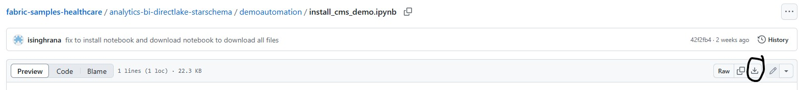
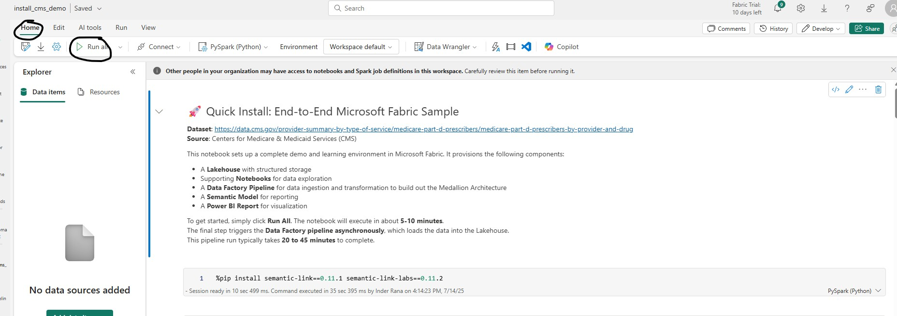

# Quick Install - Fabric Lakehouse and Power BI Direct Lake Connector with 275 Million Rows

[Main Readme for overall architecture diagram](../README.md)

**Pre-Requisite**: Fabric-enabled Workspace

## Steps to setup demo in your own environment

1. Open [install_cms_demo](./demoautomation/install_cms_demo.ipynb) Spark Notebook from the GitHub Repo and download to local machine using the *Download Raw File* button on the top right corner as shown in the screenshot below

    

2. Import the downloaded Notebook into Fabric Workspace by clicking "Import > Notebook > From this computer". **We recommend using a new Workspace with nothing in it to prevent any potential conflicts. The notebooks will create everything for you.**

    

3. Once the import is complete, open the **`install_cms_demo`** notebook and click **`Run All`** to execute all cells sequentially.

    

   - The notebook will execute each cell one by one. The final cell triggers the **Fabric Data Factory pipeline**.
   - This pipeline runs **asynchronously** and typically takes **20 to 45 minutes** to complete.
   - At this point, the notebook execution is complete—you can safely close it.
   - Workspace should have all the components available as shown in the screenshot, you’re free to step away and return later; the **Lakehouse tables will be loaded with data** once the pipeline finishes.

    

4. Monitor Pipeline Execution - Navigate to the **Fabric Data Factory pipeline**, then from Run menu click **“View Run History”** to see the execution history and click the Activity Name **cms_pipeline** to monitor the execution details. Alternatively you can use Fabric Monitor Hub to monitor the pipeline execution.

  

***

## [Create Fabric Data Agent and query from Azure AI Foundry Agent - Optional Step](./docs/5-CreateAISkill.md) 

This step guides you through creating a **Fabric Data Agent** that utilizes the Lakehouse Tables from the solution. The agent enables **natural language queries using text-to-SQL**, allowing users to interact with data conversationally. Also find instructions for querying the Fabric Data Agent from an **Azure AI Foundry Agent**.
