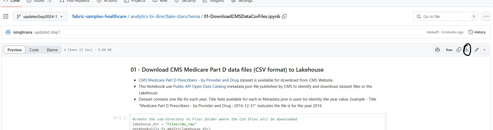
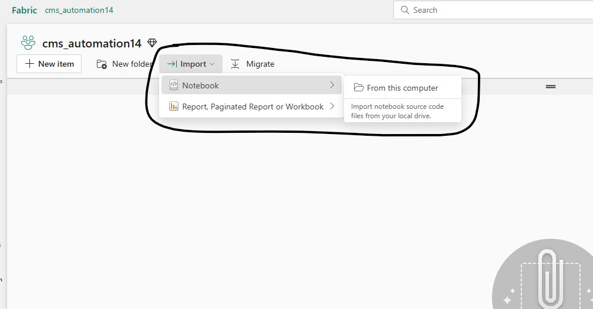

## Create Lakehouse and setup Spark Notebooks

In this step you will create Lakehouse and setup Spark Notebooks to be used for downloading csv files and creation of Lakehouse Tables (Delta Parquet) from those files 

1. Open your Fabric Workspace and switch to the Fabric persona using the menu on bottom left corner (the screenshot below shows the buttons for Lakehouse creation)

2. Create a new Lakehouse by clicking New Item > (search for "lake") > Lakehouse. 
 Use the name **cms_lakehouse** if not using an existing Lakehouse (schema enabled or not either of two options work)

4. Open [01-DownloadCMSDataCsvFiles](../01-DownloadCMSDataCsvFiles.ipynb) Spark Notebook from the GitHub Repo and download to local machine using the *Download Raw File* button on top right corner as shown in the screenshot below

    

5. Repeat download step for [02-CreateCMSDataTable](../02-CreateCMSDataTable.ipynb) and [03-CreateCMSStarSchemaTables](../03-CreateCMSStarSchemaTables.ipynb) Spark Notebooks
   
6. Import the three downloaded Notebooks into Fabric Workspace by clicking "Import > Notebook > From this computer"

    

7. Once the import is successful Open **01-DownloadCMSDataCsvFiles** Notebook, add the Lakehouse created in Step 2 as default lakehouse using **Add data items > Exising data souces** option. 
    

Select your **cms_lakehouse** and click **Connect.**

8. Repeat Step 6 for **02-CreateCMSDataTable** and **03-CreateCMSStarSchemaTables** Notebooks

***
[Back to main Readme](../manual-setup.md#step-1-create-lakehouse-and-setup-spark-notebooks)
