## Create Pipeline to ingest raw data, build silver layer flat table and gold layer star schema tables in **Fabric Lakehouse** using Spark Notebooks

In this step you will create a Fabric Data Factory Pipeline to execute the previously imported three Spark Notebooks. Once the Pipeline executes successfully you will have all three layers of Medallion architecture created with Gold Layer being Star Schema Tables in a Lakehouse ready to be used for reporting.

1. Open **01-DownloadCMSDataCsvFiles** Notebook from your workspace
2. Open the *Run* options tab by clicking **Run** button in the toolbar 
3. Clck **Add to Pipeline** button and select **New Pipeline** option
   
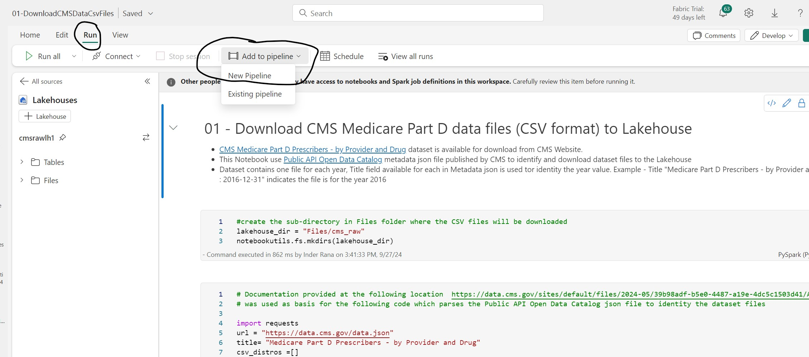

4. Specify appropriate name for the Pipeline example **cms_data_pipeline** and click **Create** button to open Data Pipeline canvas
5. Select the **Notebook** Activity on canvas to give appropriate name like **DownloadCMSData** as shown in the screenshot below, also review the Settings tab for activity (Workspace and Notebook settings are automatically set appropriately because Pipeline was created from Notebook)
   
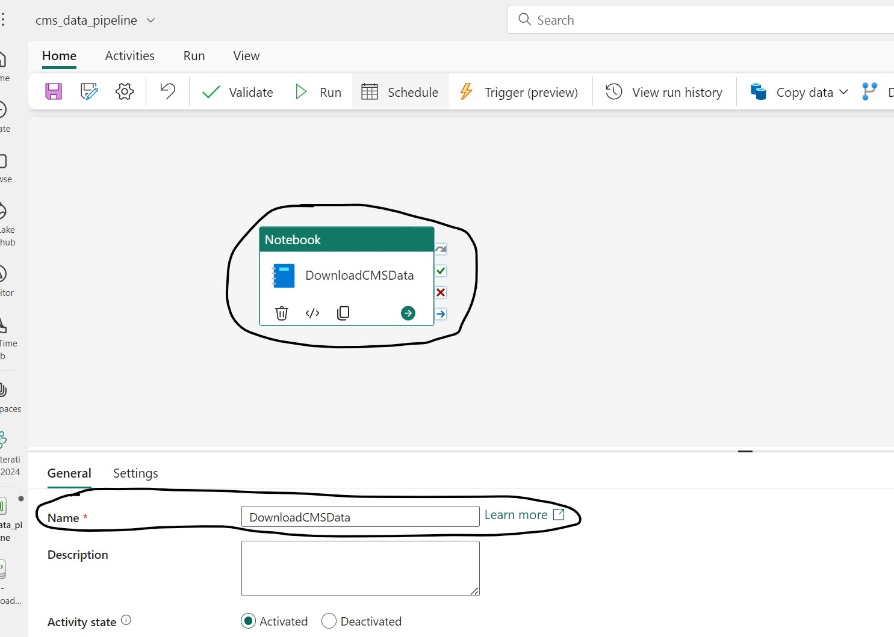

6. Open the *Activities* menu by clicking **Activities** button in the Toolbar
7. Click **Notebook** button which will add a new Notebook activity on the canvas
   
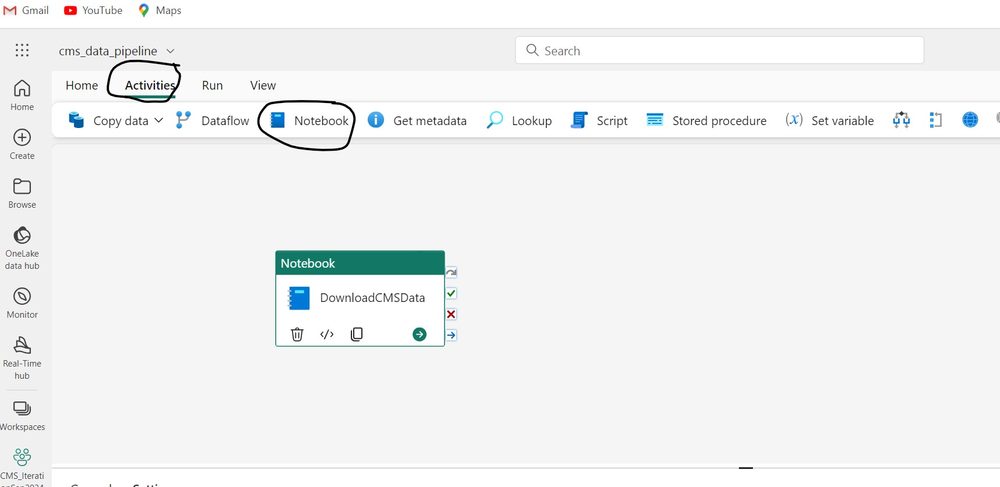
    
8. Select the new Notebook Activity, on the General Tab set an appropriate name like **CreateCMSDataTable**
   
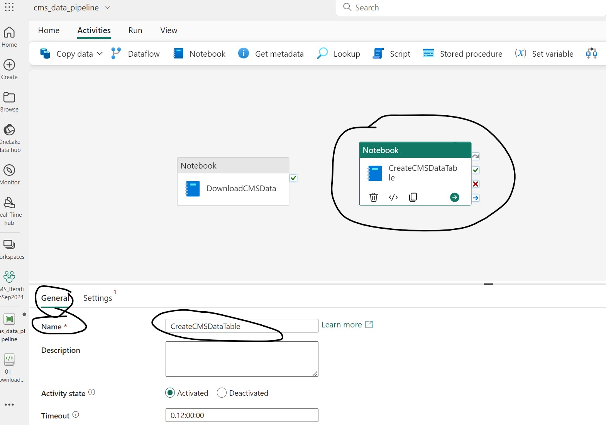

9.  With CreateCMSDataTable Notebook Activity selected, switch to the Settings Tab and select **02-CreateCMSDataTable** Notebook.

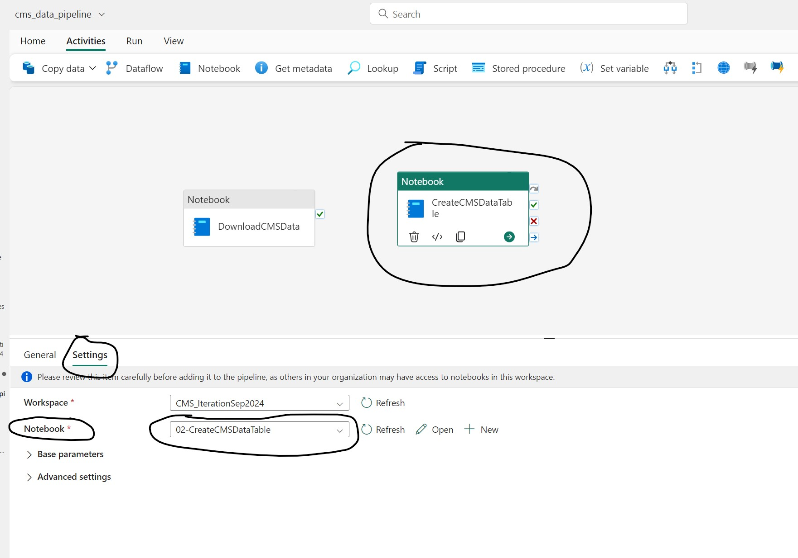

10. Now, repeat Steps 7 to 9 to add another Notebook Activity for **03-CreateCMSStarSchemaTables** Notebook so that Data Pipeline canvas looks like the screenshot below.

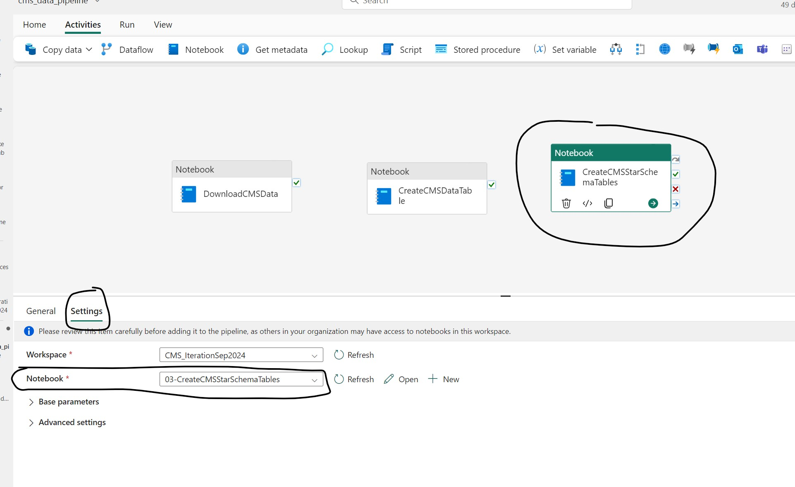
    
11. Connect three Activities by dragging **On Success** link from **DownlaodCMSData** Activity to **CreateCMSDataTable** Activity and from **CreateCMSDatable** Activity to **CreateCMSSTarSchemaTables** as show in the screenshot below.
   
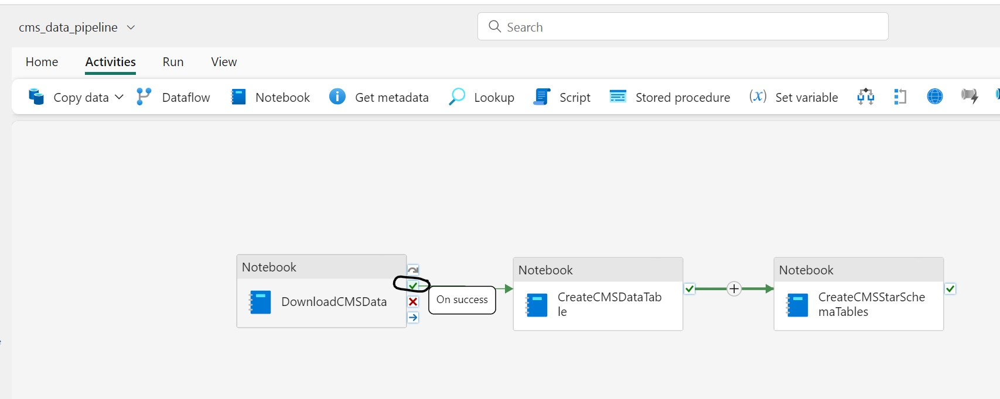

12. Make sure to save changes to the Pipeline

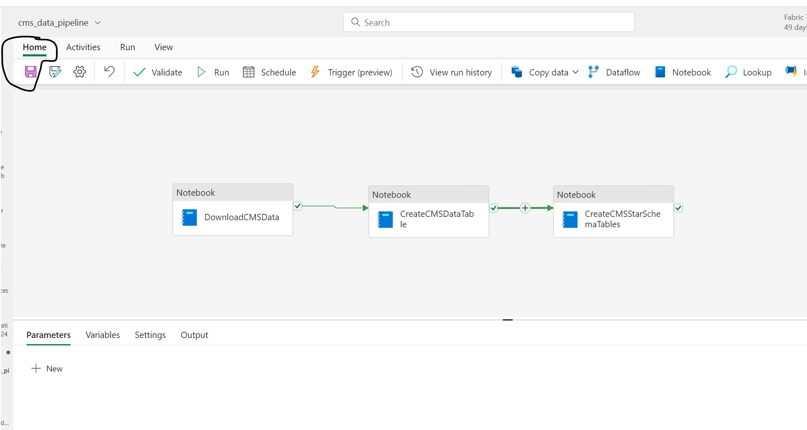

13. Click **Run** button from Home menu to start execution of the pipeline, the pipeline job execution can take anywhere between 20 to 40 minutes but it runs non-iteractive so you can close the browser and walk away to check back later.

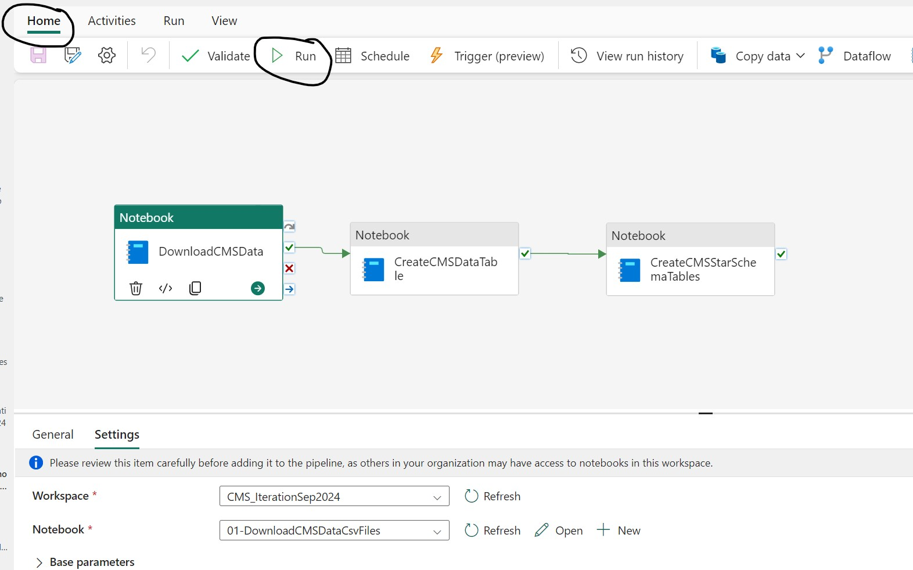

14. Pipeline Job execution can be monitored from Monitoring Hub as shown in the screenshot below

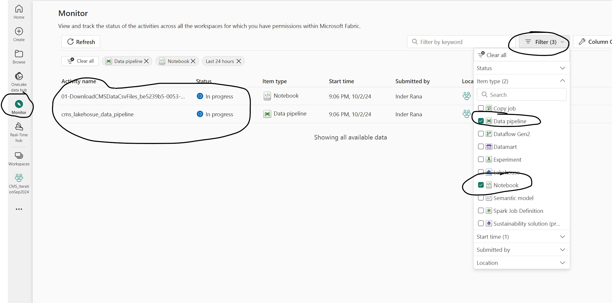

Once the Pipeline Job is complete click the Pipeline Job Name link on the Monitoring Hub to see the execution details

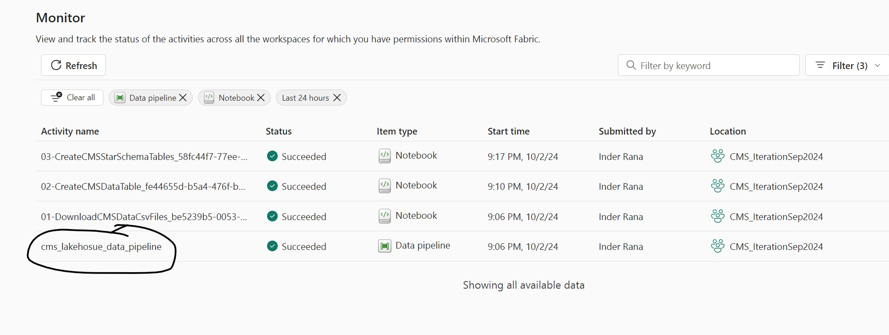   

Screenshot below shows the details for a successful run in about 20 minutes on a F64 SKU (on a F2 SKU about 40 minutes execution time was observed)

If you browse to your Lakehouse you will see Lakehouse Files and Tables populated with data
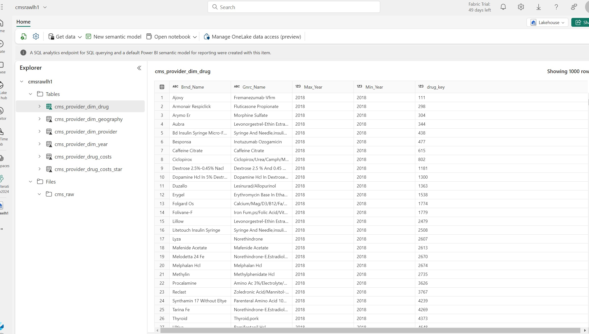

- Bronze Layer - **cms_raw** folder in the Files section is the Bronze Layer and has raw CSV files downloaded from CMS Website
- Silver Layer - **cms_provider_drug_costs** is the flat table with 250 million rows used as source for creating Gold Layer Star Schema Tables
- Gold Layer **cms_provider_dim_drug**, **cms_provider_dim_geography**, **cms_provider_dim_provider** **cms_provider_dim_year** are the Dimension Tables, **cms_provider_drug_costs_star** is the fact table

***

[Back to main Readme](../manual-setup.md#step-2-download-raw-files-and-build-out-silver-and-gold-layer-tables-star-schema-to-be-used-for-reporting) | [Next](./3-CreatePBISemanticModel.md)
