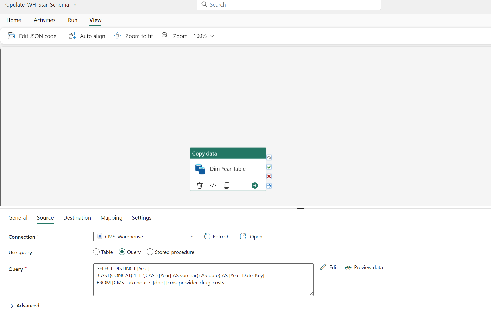
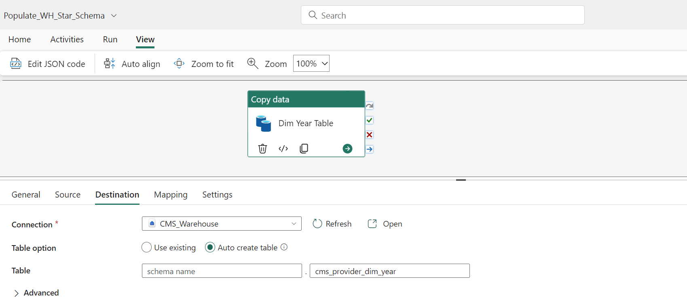

## Setup Pipeline buld Gold Layer in Fabric Warehouse

At the time of writing this documentation, it is not posible to upload or paste the JSON from a Pipeline into Fabric to create a new Pipeline. Once that capabilitiy is added, sample code will replace manual steps in this repo.

You will create a Fabric Data Factory Pipeline which will first run SQL scripts to create the dimension tables, then it will run a script to create a staging table that accounts for missing key values and lastly it will create the fact table. There may be more efficient ways to create the fact table but this method runs quickly with 250M rows.

1. Open up your Fabric Workspace and switch to Data Engineering persona using the menu on bottom left corner
2. Create a new Warehouse or use an existing one. Examples in this repo will use the name **CMS_Warehouse**
3. From the Workspace select **+New** > **Show all** > **Data pipeline**
4. Name the pipeline **Populate_WH_Star_Schema**
5. Select **Add** > **Copy data**
6. Rename the **Copy data** activity to **Dim Year Table**
7. Change the source to the Workspace's Fabric Warehouse (**CMS_Warehouse**) and select **Query** for the **Use query** option. Paste in the query from this Repo linked here: [01_cms_provider_dim_year.sql](../scripts/01_cms_provider_dim_year.sql) . The Warehouse will run the SQL query which pulls data from **CMS_Lakehouse**. Your Pipeline should look like this:

8. Change the destination to the Workspace's Fabric Warehouse (**CMS_Warehouse**) Table, for the option **Table option** select **Auto create table** and name it **cms_provider_dim_year**. Your Pipeline should look like this:

9. Import and validate the schema for the **Mapping**
10. Repeat steps 5-9 for the other three dimension tables, the staging table that will be used to create the fact table, and the fact table as listed below:

 | Activity name | SQL script | Warehouse Destination table | 
 | ------------- | --------------------------------- | ------------------------------------------- | 
 | Dim Year Table | [01_cms_provider_dim_year.sql](../scripts/01_cms_provider_dim_year.sql) | cms_provider_dim_year | 
 | Dim Drug Table | [02_cms_provider_dim_drug.sql](../scripts/02_cms_provider_dim_drug.sql) | cms_provider_dim_drug | 
 | Dim Geo Table | [03_cms_provider_dim_geography.sql](../scripts/03_cms_provider_dim_geography.sql) | cms_provider_dim_geography | 
 | Dim Provider Table | [04_cms_provider_dim_provider.sql](../scripts/04_cms_provider_dim_provider.sql) | cms_provider_dim_provider | 
 | Fact No Nulls Staging | [05_cms_provider_no_null_key.sql](../scripts/05_cms_provider_fact_no_null_key.sql) | cms_provider_fact_no_null_key | 
 | Fact Table | [06_cms_provider_drug_costs_star.sql](../scripts/06_cms_provider_drug_costs_star.sql) | cms_provider_drug_costs_star | 

11. For each of the activities that are for dimensions having "Dim" in the name and the activity named **Fact No Nulls Staging**, drag the **On success** green check and drop on the activity for **Fact Table** which will write the fact table.
12. Add a new Activity for **Script**, name it **Drop Staging Table**, set the **Connection** to **CMS_Warehouse**, under **Settings** set the **Script** to **Query** and paste in the code linked here: [07_cms_drop_staging_table.sql](../scripts/07_cms_drop_staging_table.sql) . This will remove the unnecessary staging table which was used to populate the fact table.
13. Drag the green check from **Fact Table** to **Drop Staging Table**. Your Pipeline should now look like this:

14. On the Pipeline ribbon, click **Run** and the Pipeline will populate the Fabric Warehouse with the dimensions and staging table for the CMS data. You do not need to schedule the Pipeline since it is a one-time load.

***

[Back to main Readme](../Readme.md) 