## Create Pipeline to ingest raw data and build silver layer flat table in **Fabric Lakehouse** and create second pipeline to build gold layer star schema tables in **Fabric Warehouse** using SQL Stored Procedures (SPROCs)

In this section you will creating two Fabric Data Factory Pipelines:
* First Pipeline will have two steps to run Spark Notebooks to ingest raw data CSV files and create flat table in **Fabric Lakehouse** hence will setup Bronze and Silver Layer.
* Second Pipeline will use Silver Layer from the first pipeline as source with SQL Stored Procedures (SPROCs) to create the Dimension tables and a Fact table in a **Fabric Warehouse** which will serve as the Gold Layer.

### Create Pipeline for Bronze and Silver Layers in Lakehouse
1. Open **01-DownloadCMSDataCsvFiles** Notebook from your workspace
2. Open the *Run* options tab by clicking **Run** button in the toolbar 
3. Clck **Add to Pipeline** button and select **New Pipeline** option
   

4. Specify appropriate name for the Pipeline example **PopulateCMSLakehouse_Pipeline** and click **Create** button to open Data Pipeline canvas
5. Select the **Notebook** Activity on canvas to give appropriate name like **DownloadCMSData** as shown in the screenshot below, also review the Settings tab for activity (Workspace and Notebook settings are automatically set appropriately because Pipeline was created from Notebook)
   
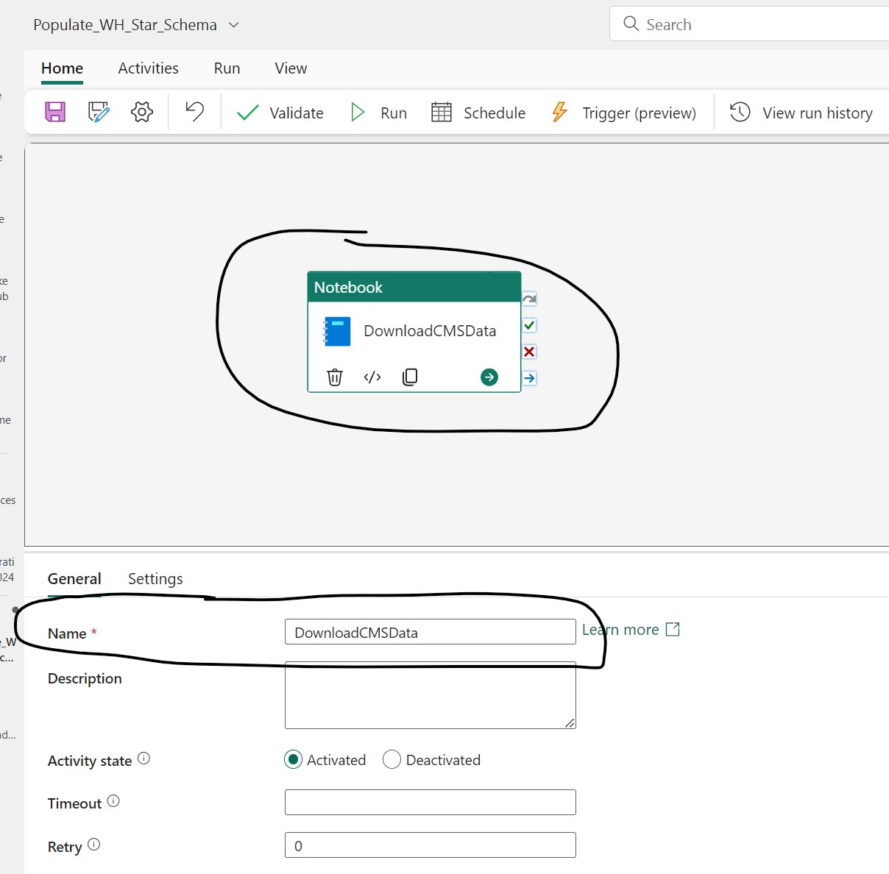

6. Open the *Activities* menu by clicking **Activities** button in the Toolbar
7. Click **Notebook** button which will add a new Notebook activity on the canvas
   
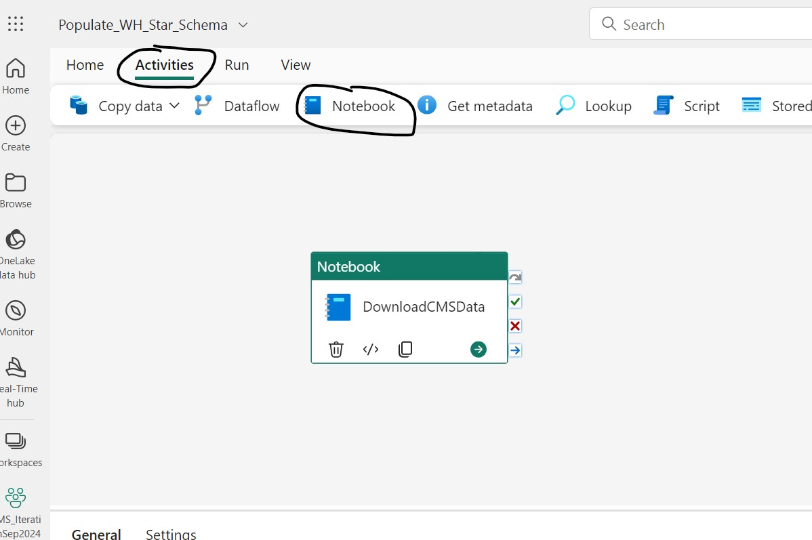
    
8. Select the new Notebook Activity, on the General Tab set an appropriate name like **CreateCMSDataTable**
   
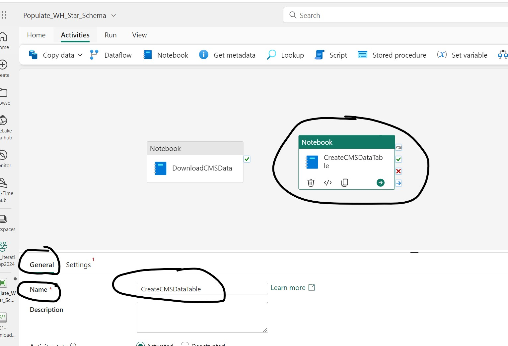

9.  With CreateCMSDataTable Notebook Activity selected, switch to the Settings Tab and select **02-CreateCMSDataTable** Notebook.

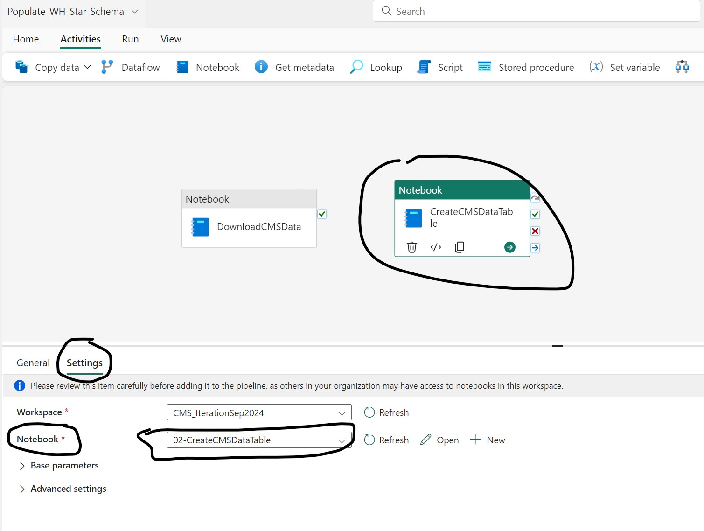

10. Connect the two Notebook Activities by dragging **On Success** link from **DownlaodCMSData** Activity to **CreateCMSDataTable** Activity as show in the screenshot below.
   
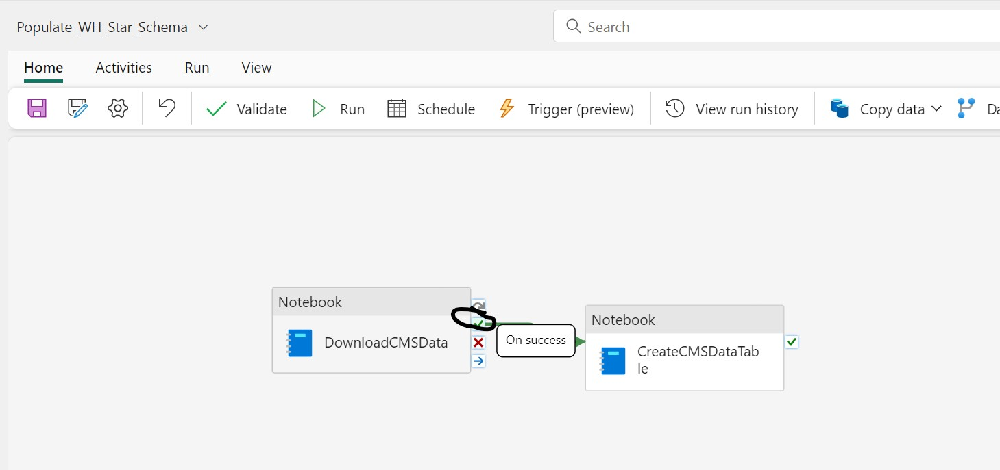

11. Make sure to save changes to the Pipeline and then click **Run** button from Home menu to start execution of the pipeline, the pipeline job runs non-iteractively so you can close the browser and walk away to check back later.

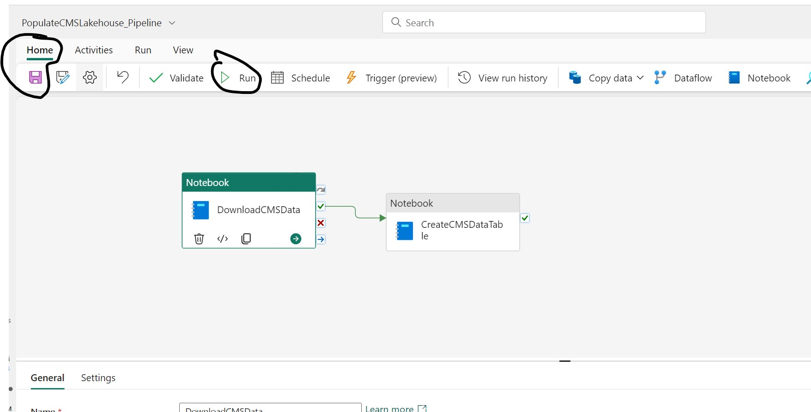

12. Pipeline Job execution can be monitored from Monitoring Hub as shown in the screenshot below

Once the Pipeline Job is complete click the Pipeline Job Name link on the Monitoring Hub to see the execution details

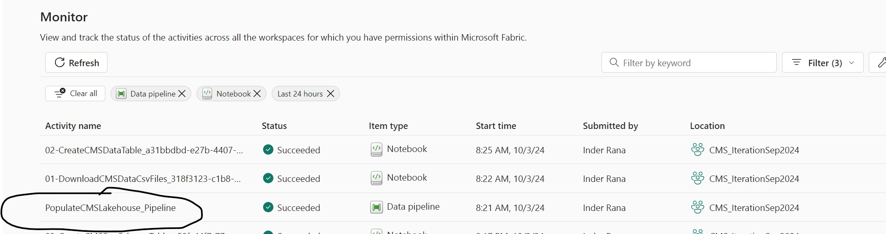   

Screenshot below shows the details for a successful run in about 11 minutes on a F64 SKU

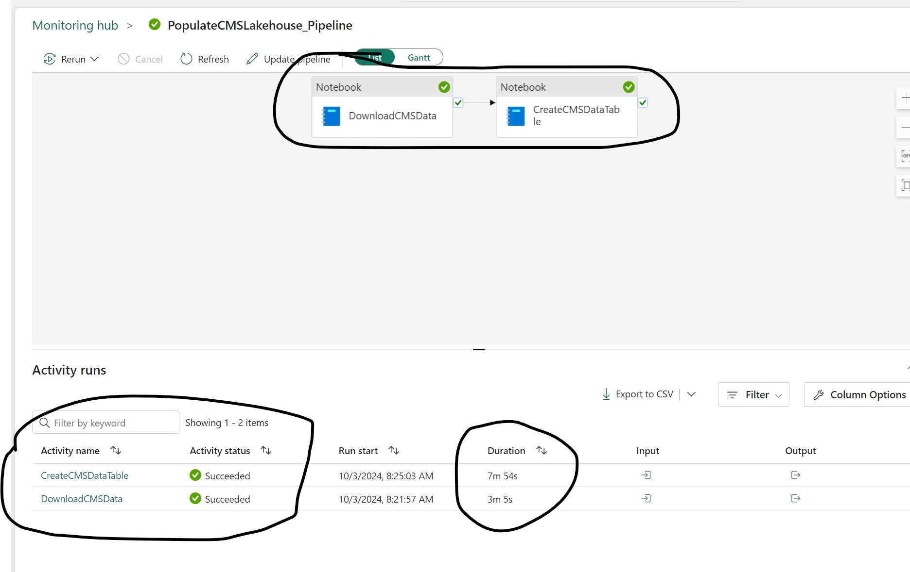

If you browse to your Lakehouse you will see Lakehouse Files and Tables populated with data.
**cms_provider_drug_costs** is the flat table with 250 million rows used as source for creating Gold Layer Star Schema Tables in the section
**cms_raw** folder in the Files section has the raw CSV files downloaded from CMS Website

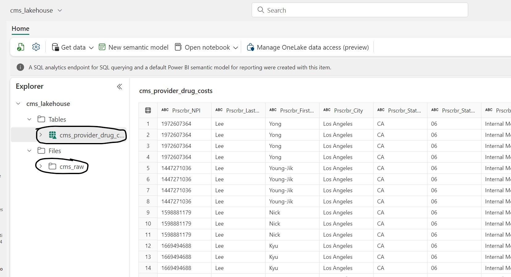

### Create Gold Layer in Warehouse
1. Create a new **Fabric Warehouse** from your Fabric Workspace or use an existing one. Examples in this repo will use the name **cms_warehouse**
2. In **cms_warehouse** select **New SQL query** > **New SQL query**
3. Paste in the query from this repo linked here: [01_CMS_provider_dimensions_SPROC.sql](../scripts/01_CMS_provider_dimensions_SPROC.sql) . Validate that the Lakehouse name matches your implementation. Run the script, and you should now see a Stored Procedure named **usp_CreateAndPopulateDimTables** in your Warehouse.
4. Repeat the process for the fact table. In **cms_warehouse** select **New SQL query** > **New SQL query**
5. Paste in the query from this repo linked here: [02_CMS_provider_fact_SPROC.sql](../scripts/02_CMS_provider_fact_SPROC.sql) . Validate that the Lakehouse and Warehouse names match your implementation. Run the script, and you should now see a Stored Procedure named **usp_CreateAndPopulateFactTable** in your Warehouse. Your Fabric Warehouse should now look like this:

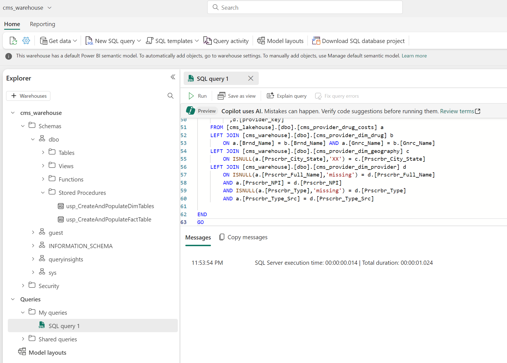
   
6. From the Workspace select **+New** > **Show all** > **Data pipeline**
7. Name the pipeline **Populate_WH_Star_Schema**
8. Select **Activites** > **Stored procedure**
9. Rename the **Stored procedure1** activity to **Populate Dims SPROC**
10. Under **Settings** > **Connection** select **cms_warehouse**. For **Stored procedure** select **usp_CreateAndPopulateDimTables**.
11. Repeat the process for the fact table SPROC. Select **Activites** > **Stored procedure**
12. Rename the **Stored procedure2** activity to **Populate Fact SPROC**
13. Under **Settings** > **Connection** select **cms_warehouse**. For **Stored procedure** select **usp_CreateAndPopulateFactTable**.
14. For the SPROC activity named **Populate Dims SPROC** drag the **On success** green check and drop on the activity for **Populate Fact SPROC** which will write the fact table after the dimensions have been populated. Your Pipeline should now look as follows:

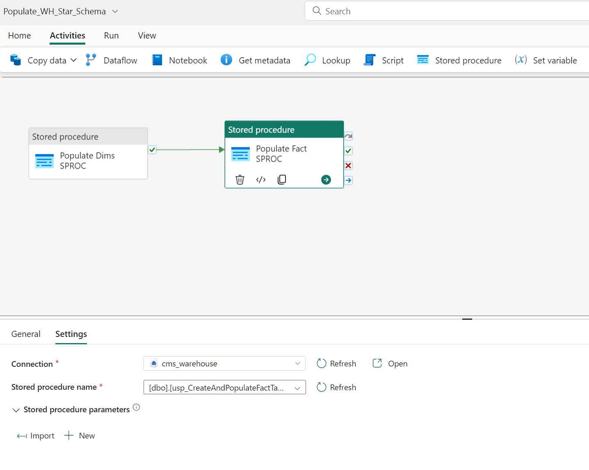

15. On the Pipeline ribbon, click **Run** and the Pipeline will populate the Fabric Warehouse with the dimensions and staging table for the CMS data. You do not need to schedule the Pipeline since it is a one-time load.

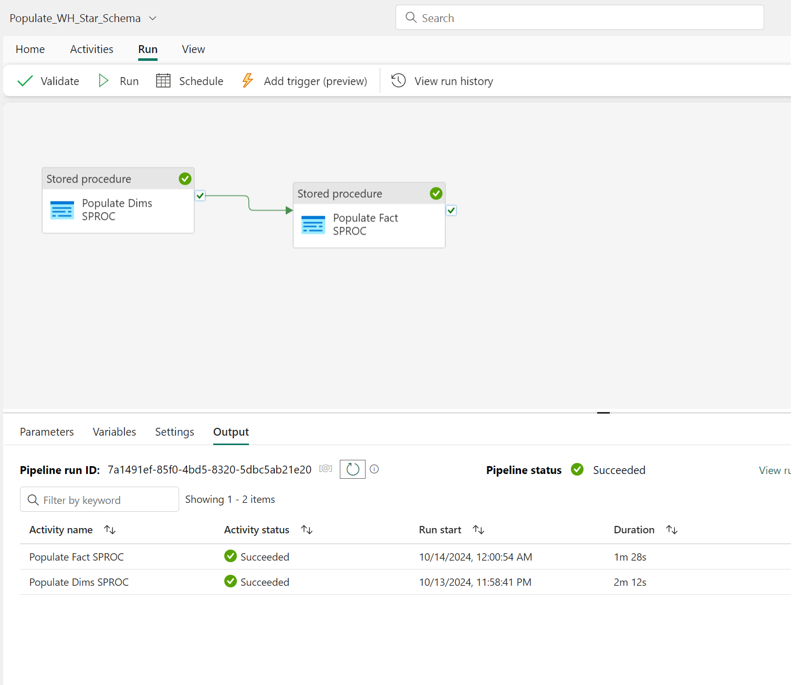
    
***
[Back to main Readme](../manual-setup.md#step-2-download-raw-files-and-build-out-silver-and-gold-layer-tables-star-schema-to-be-used-for-reporting) | [Next](./3-CreatePBISemanticModel.md)

