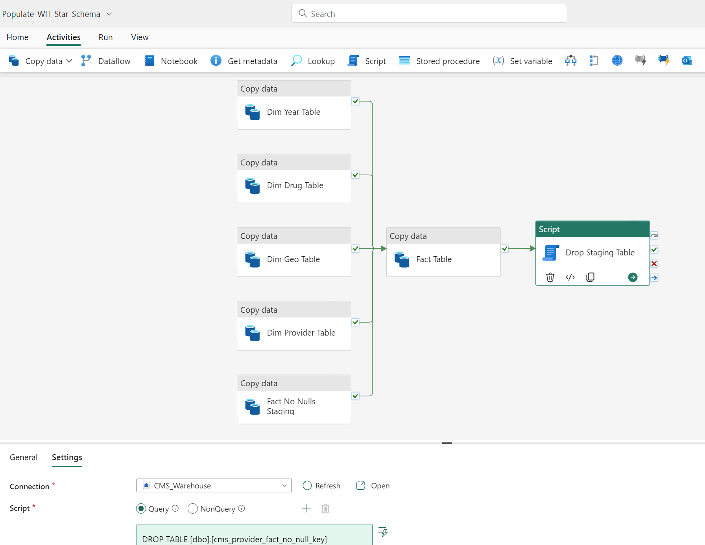

## Create Pipeline to ingest raw data and build silver layer flat table in **Fabric Lakehouse** and create second pipeline to build gold layer star schema tables in **Fabric Warehouse** using SQL Stored Procedures (SPROCs)

In this section you will creating two Fabric Data Factory Pipelines:
* First Pipeline will have two steps to run Spark Notebooks to ingest raw data CSV files and create flat table in **Fabric Lakehouse** hence will setup Bronze and Silver Layer.
* Second Pipeline will use Silver Layer from the first pipeline as source with SQL Stored Procedures (SPROCs) to create the Dimension tables and a Fact table in a **Fabric Warehouse** which will serve as the Gold Layer.

### Create Pipeline for Bronze and Silver Layers in Lakehouse
1. Open **01-DownloadCMSDataCsvFiles** Notebook from your workspace
2. Open the *Run* options tab by clicking **Run** button in the toolbar 
3. Clck **Add to Pipeline** button and select **New Pipeline** option
   

4. Specify appropriate name for the Pipeline example **PopulateCMSLakehouse_Pipeline** and click **Create** button to open Data Pipeline canvas
5. Select the **Notebook** Activity on canvas to give appropriate name like **DownloadCMSData** as shown in the screenshot below, also review the Settings tab for activity (Workspace and Notebook settings are automatically set appropriately because Pipeline was created from Notebook)
   

6. Open the *Activities* menu by clicking **Activities** button in the Toolbar
7. Click **Notebook** button which will add a new Notebook activity on the canvas
   

    
8. Select the new Notebook Activity, on the General Tab set an appropriate name like **CreateCMSDataTable**
   

9.  With CreateCMSDataTable Notebook Activity selected, switch to the Settings Tab and select **02-CreateCMSDataTable** Notebook.

10. Connect the two Notebook Activities by dragging **On Success** link from **DownlaodCMSData** Activity to **CreateCMSDataTable** Activity as show in the screenshot below.
   

11. Make sure to save changes to the Pipeline and then click **Run** button from Home menu to start execution of the pipeline, the pipeline job runs non-iteractively so you can close the browser and walk away to check back later.

12. Pipeline Job execution can be monitored from Monitoring Hub as shown in the screenshot below

Once the Pipeline Job is complete click the Pipeline Job Name link on the Monitoring Hub to see the execution details

   

Screenshot below shows the details for a successful run in about 11 minutes on a F64 SKU

If you browse to your Lakehouse you will see Lakehouse Files and Tables populated with data.
**cms_provider_drug_costs** is the flat table with 250 million rows used as source for creating Gold Layer Star Schema Tables in the section
**cms_raw** folder in the Files section has the raw CSV files downloaded from CMS Website

### Create Gold Layer in Warehouse
1. Create a new Warehouse or use an existing one. Examples in this repo will use the name **cms_warehouse**
2. In **cms_warehouse** select **New SQL query** > **New SQL query**
3. 
4. From the Workspace select **+New** > **Show all** > **Data pipeline**
5. Name the pipeline **Populate_WH_Star_Schema**
6. Select **Add** > **Copy data**
7. Rename the **Copy data** activity to **Dim Year Table**
8. Change the source to the Workspace's Fabric Warehouse (**cms_warehouse**) and select **Query** for the **Use query** option. Paste in the query from this Repo linked here: [01_cms_provider_dim_year.sql](../scripts/01_cms_provider_dim_year.sql) . The Warehouse will run the SQL query which pulls data from **CMS_Lakehouse**. Your Pipeline should look like this:

9. Change the destination to the Workspace's Fabric Warehouse (**CMS_Warehouse**) Table, for the option **Table option** select **Auto create table** and name it **cms_provider_dim_year**. Your Pipeline should look like this:

10. Import and validate the schema for the **Mapping**
11. Repeat steps 4-8 for the other three dimension tables, the staging table that will be used to create the fact table, and the fact table as listed below:

 | Activity name | SQL script | Warehouse Destination table | 
 | ------------- | --------------------------------- | ------------------------------------------- | 
 | Dim Year Table | [01_cms_provider_dim_year.sql](../scripts/01_cms_provider_dim_year.sql) | cms_provider_dim_year | 
 | Dim Drug Table | [02_cms_provider_dim_drug.sql](../scripts/02_cms_provider_dim_drug.sql) | cms_provider_dim_drug | 
 | Dim Geo Table | [03_cms_provider_dim_geography.sql](../scripts/03_cms_provider_dim_geography.sql) | cms_provider_dim_geography | 
 | Dim Provider Table | [04_cms_provider_dim_provider.sql](../scripts/04_cms_provider_dim_provider.sql) | cms_provider_dim_provider | 
 | Fact No Nulls Staging | [05_cms_provider_no_null_key.sql](../scripts/05_cms_provider_fact_no_null_key.sql) | cms_provider_fact_no_null_key | 
 | Fact Table | [06_cms_provider_drug_costs_star.sql](../scripts/06_cms_provider_drug_costs_star.sql) | cms_provider_drug_costs_star | 

10. For each of the activities that are for dimensions having "Dim" in the name and the activity named **Fact No Nulls Staging**, drag the **On success** green check and drop on the activity for **Fact Table** which will write the fact table.
11. Add a new Activity for **Script**, name it **Drop Staging Table**, set the **Connection** to **CMS_Warehouse**, under **Settings** set the **Script** to **Query** and paste in the code linked here: [07_cms_drop_staging_table.sql](./scripts/07_cms_drop_staging_table.sql) . This will remove the unnecessary staging table which was used to populate the fact table.
12. Drag the green check from **Fact Table** to **Drop Staging Table**. Your Pipeline should now look like this:

13. On the Pipeline ribbon, click **Run** and the Pipeline will populate the Fabric Warehouse with the dimensions and staging table for the CMS data. You do not need to schedule the Pipeline since it is a one-time load.

***
[Back to main Readme](../Readme.md#step-2-download-raw-files-and-build-out-silver-and-gold-layer-tables-star-schema-to-be-used-for-reporting) | [Next](./3-CreatePBISemanticModel.md)

