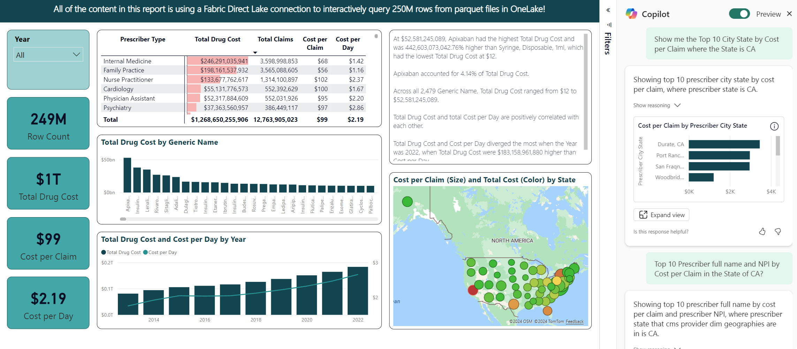

## Create Reports using Power BI or Connect using Excel

1. You can create a new Power BI report in Fabric by either clicking "New report" in the Data model view, clicking "Create report" from the ellipse in the Workspace view of the dataset, or by connecting to the Fabric Lakehouse using Power BI Desktop.
2. You can also use "Analyze in Excel" from the ellipse next to the dataset in the Fabric Workspace.
3. You can use the existing report template by downloading a copy of the Power BI Report template from the file in this repo at [analytics-bi-directlake-warehouse-starschema](../CMS%20Medicare%20Part%20D%20Star%20Schema%20Template.pbix)
    - Open the file using Power BI Desktop
    - If you get a connection error, click **Edit** to connect the report to your Lakehouse
    - Connect to your Fabric Lakehouse
    - Publish the Power BI report to your Fabric Workspace
The Power BI Report that connects to the Direct Lake Semantic Model shoul look like this, and be ready for use with Power BI Copilot:
 

*** 
[Back to main Readme](../manual-setup.md#step-4-create-reports-using-power-bi-or-connect-using-excel----steps-are-manual-at-this-time-but-in-future-plan-to-automate-for-quick-setup-) 
