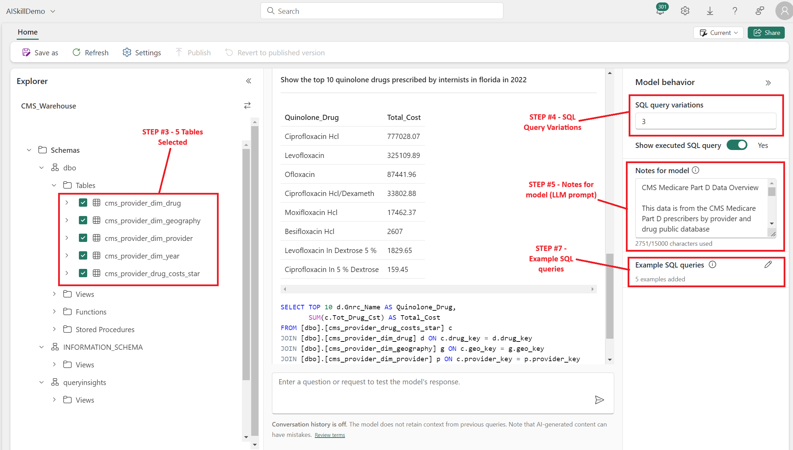

## Create Fabric AI Skill

1. You can create a new Fabric AI Skill while in your Workspace by clicking **+ New item** > **AI Skill (preview)**. Give the AI Skill a name and click **Create**.
2. Next, select the Fabric Lakehouse or Warehouse that you would like to query using the AI Skill. If you followed step 2a and deployed a star schema in the Lakehouse select **cms_lakehouse**, and if you followed step 2b and deployed a star schema in the warehouse select **cms_warehouse.** Then click **Confirm.**
3. In the vertical panel on the left hand side of the screen, select the five tables **cms_provider_dim_drug**, **cms_provider_dim_provider**, **cms_provider_dim_drug**, **cms_provider_dim_geography**, **year**, and **cms_provider_drug_costs_star**. The boxes next to the table names should be checked green. Click **Get Started** in the middle of the screen.
4. In the column on the right side of the page named **Model behavior** you will see a setting for **SQL query variations** at the top. I usually leave it at the default setting of **3** but you can theoretically 1) increase it for more back-end iterations of query versions from the underlying LLM (Azure OpenAI **L**arge **L**anguage **M**odel), or 2) decrease it for fewer query variations. Fabric CU compute usage will theoretically go up and down as you change the values, too.
5. The setting on the right hand side for **Notes for model** will give instructions to the LLM that provide context or metadata for the queries. This text is similar to a System message in Azure AI Foundry Chat. Paste in text from the example in the repo [AI_Skills_01_NotesForModel.txt](../scripts/AI_Skills_01_NotesForModel.txt) for initial testing. This example text has been modified and optimized a few times, but you can also experiment with changing it and improving the results. Testing and new iterations may produce better results with a richer vocabulary. If you make significant improvements, please let us know and pass them along! 
6. Download the .json file [AI_Skills_02_SQL_Examples.json](../scripts/AI_Skills_02_SQL_Examples.json)
7. The last setting in the right hand column is titled **Example SQL queries**. Click the pencil icon next to that heading. Click **Import from json** and Upload the file you just downloaded at [AI_Skills_02_SQL_Examples.json](../scripts/AI_Skills_02_SQL_Examples.json) 

Your Fabric AI Skill is now ready to test with natural language queries, and should look like this:

 

8. A few examples of queries to try include:
   - Show the top 10 quinolone drugs prescribed by internists in florida in 2022
   - Show the Top 20 internists in Maine prescribing ace inhibitors in 2021
   - Show the top 5 doctors prescribing ARBs in Atlanta Georgia with the last name Smith in the year 2019
10. Words that the AI Skills demo will understand can be found in the text you pasted in **Notes for model** such as ace inhibitors, ARBs, quinolones, internists, etc. 

*** 
[Back to main Readme](../Readme.md#step-5-create-AI-skill)
