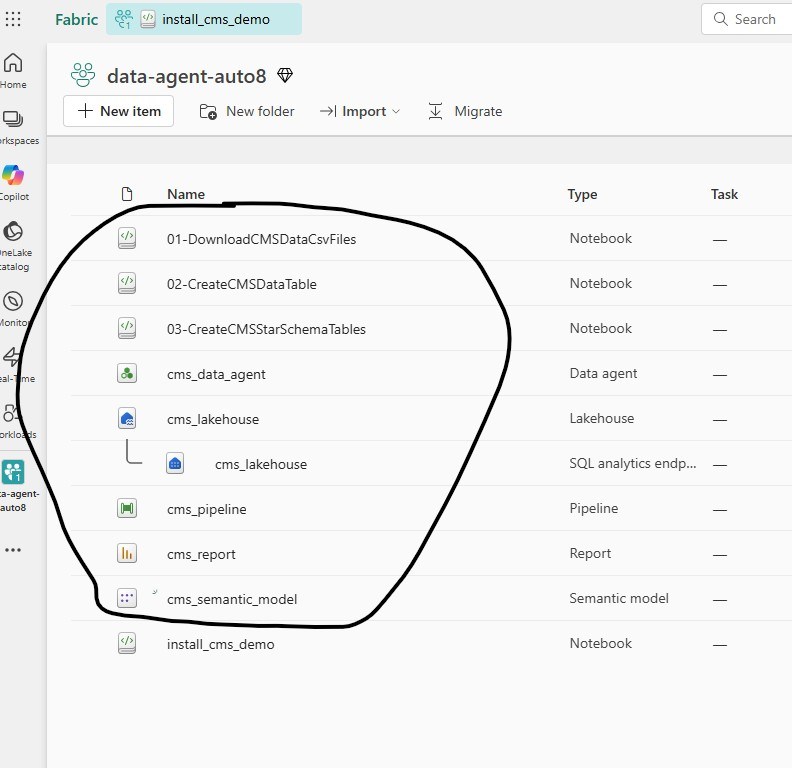

# Quick Install - End-to-End Fabric Analytic Sample - Lakehouse, Pipeline, Notebooks, Power BI Report and Data Agent 

[Back to Main Readme](./Readme.md)

This guide walks you through installing the complete solution, which includes: **Lakehouse, Pipeline, Notebooks, Semantic Model, Report and Data Agent**

### ✅ Installation in Just 3 Steps

1. Download the [install_cms_demo](./demoautomation/install_cms_demo.ipynb) Fabric Spark Notebook from GitHub  
2. Import the notebook into your Fabric workspace
3. Run the notebook to deploy the entire solution

For detailed instructions, follow the step-by-step guide below or watch this quick Youtube video https://www.youtube.com/watch?v=RgQu1CL9QfM.

## Architecture


***

**Table of Contents**:  
  - [Prerequisites](#prerequisites)
  - [Steps to setup demo in your own environment](#steps-to-setup-demo-in-your-own-environment)
  - [Fabric Data Agent - Sample Questions to Chat with your data](#fabric-data-agent---sample-questions-to-chat-with-your-data)
  - [Fabric Lakehouse SQL Endpoint - Sample SQL Queries](#fabric-lakehouse-sql-endpoint---sample-sql-queries)

***

## Prerequisites

*   **Fabric-enabled Workspace**
*   [**Fabric Data Agent**](https://learn.microsoft.com/en-us/fabric/data-science/concept-data-agent) (Optional)    
    *   The installation script attempts to create a Fabric Data Agent by default. If this step fails due to tenant settings, all other components will still install successfully. Any Data Agent creation errors can be safely ignored.
    * If you prefer to skip the Data Agent creation step, open the installation notebook after importing it into your Fabric workspace and set the `invoke_data_agent_create_step` variable to `False` in the first code cell.
    *   **Fabric Trial Capacity cannot be used for Fabric Data Agent**

### ⚙️ Fabric Data Agent Settings

To enable Data Agent functionality, configure the following settings before running the installation Notebook:

1.  **Copilot and Azure OpenAI** *(Required)*
    *   **Setting**: *“Users can use Copilot and other features powered by Azure OpenAI”*
    *   **Scope**: Enable at **Tenant** or **Fabric Capacity** Level, can be scoped to specific users via **Entra Groups**

2.  **Data Residency** *(Optional – only if Fabric Capacity is outside US/EU data boundary)*
    *   **Settings**:
        *   *“Data sent to Azure OpenAI can be processed outside your capacity's geographic region...”*
        *   *“Data sent to Azure OpenAI can be stored outside your capacity's geographic region...”*
    *   **Scope**: Enable at **Tenant** or **Capacity** Level, can be scoped to specific users via **Entra Groups**

3.  **Data Agent Creation** *(Required)*
    *   **Setting**: *“Users can create and share Data agent item types”*
    *   **Scope**: Must be enabled at **Tenant level**; can be scoped to specific users via **Entra Groups**

Relevant Documentation Links:
* https://learn.microsoft.com/en-us/fabric/data-science/data-agent-tenant-settings
* https://learn.microsoft.com/en-us/fabric/fundamentals/copilot-fabric-overview#available-regions

***

## Steps to setup demo in your own environment

1. Open [install_cms_demo](./demoautomation/install_cms_demo.ipynb) Spark Notebook from the GitHub Repo and download to local machine using the *Download Raw File* button on the top right corner as shown in the screenshot below

    

2. Import the downloaded Notebook into Fabric Workspace by clicking "Import > Notebook > From this computer".**We recommend using a new Workspace with nothing in it to prevent any potential conflicts. The notebook will create all artifacts for you.**

    

3. Once the import is complete, open the **`install_cms_demo`** notebook and click **`Run All`** to execute all cells sequentially.

    

   - The notebook will execute each cell one by one. The final cell triggers the **Fabric Data Factory pipeline**.
   - This pipeline runs **asynchronously** and typically takes **20 to 45 minutes** to complete.
   - At this point, the notebook execution is complete—you can safely close it.
   - Workspace should have all the components available as shown in the screenshot, you’re free to step away and return later; the **Lakehouse tables will be loaded with data** once the pipeline finishes.

    

4. Monitor Pipeline Execution - Navigate to the **Fabric Data Factory pipeline**, then from Run menu click **“View Run History”** to see the execution history and click the Activity Name **cms_pipeline** to monitor the execution details. Alternatively you can use Fabric Monitor Hub to monitor the pipeline execution.

  

Once the Pipeline job completes the solution is available to explore Reports, run SQL Queries, generate Reports from the Semantic Model using Power BI Copilot as well as chat with your data using Fabric Data Agent. The subsequent sections share sample questions and queries that you can use with Fabric Data Agent and Lakehouse SQL Endpoint.

***

## Fabric Data Agent - Sample Questions to Chat with your data

   - What are the top 5 states by total drug costs?
   - What are the top 5 states by total drug costs for the year 2020?
   - Please share drug cost trends for Minnesota from the year 2015 to 2020
   - Show the top 10 quinolone drugs prescribed by internists in florida in 2022
   - Show the Top 20 internists in Maine prescribing ace inhibitors in 2021
   - Show the top 5 doctors prescribing ARBs in Atlanta Georgia with the last name Smith in the year 2019

***

## Fabric Lakehouse SQL Endpoint - Sample SQL Queries

```sql
-- Drug Cost for a State by Year
SELECT c.Year, SUM(c.Tot_Drug_Cst) AS Total_Drug_Cost
FROM cms_provider_drug_costs_star c
JOIN cms_provider_dim_geography g ON c.geo_key = c.geo_key
WHERE g.Prscrbr_State_Abrvtn = 'MN'
GROUP BY Year
ORDER BY Year;

-- Total Drug Cost by Year
SELECT c.Year, SUM(c.Tot_Drug_Cst) AS Total_Drug_Cost
FROM cms_provider_drug_costs_star c
GROUP BY Year
ORDER BY Year;

--Total Drug Cost by State for the Year 2021
SELECT g.Prscrbr_State_Abrvtn, SUM(c.Tot_Drug_Cst) AS Total_Drug_Cost
FROM cms_provider_drug_costs_star c
JOIN cms_provider_dim_geography g ON c.geo_key = g.geo_key
WHERE Year = 2021
GROUP BY c.Year, g.Prscrbr_State_Abrvtn;
```

---

[Back to Main Readme](./Readme.md)