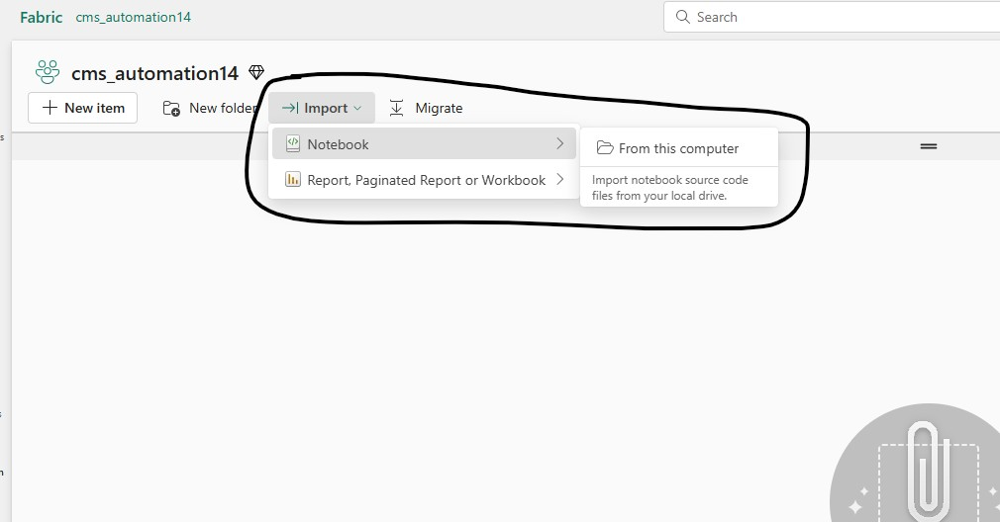

# Quick Install - Fabric Lakehouse and Power BI Direct Lake Connector with 275 Million Rows

[Back to Main Readme](./Readme.md)

## 🚀 End-to-End Fabric Demo Setup Guide

This guide walks you through installing the complete solution, which includes: **Lakehouse, Pipeline, Notebooks, Semantic Model and Report**

### ✅ Installation in Just 3 Steps

1. Download the [install_cms_demo](./demoautomation/install_cms_demo.ipynb) Fabric Spark Notebook from GitHub  
2. Import the notebook into your Fabric workspace
3. Run the notebook to deploy the entire solution

For detailed instructions, follow the step-by-step guide below or watch this quick Youtube video https://www.youtube.com/watch?v=RgQu1CL9QfM.

## 🏗️ Architecture

Here’s the updated section with your requested addition:

***

### **Prerequisites**

*   **Fabric-enabled Workspace**
*   [**Fabric Data Agent**](https://learn.microsoft.com/en-us/fabric/data-science/concept-data-agent) (Optional)    
    *   The installation script attempts to create a Fabric Data Agent by default. If this step fails due to tenant settings, all other components will still install successfully. Any Data Agent creation errors can be safely ignored.
    * If you prefer to skip the Data Agent creation step, open the installation notebook after importing it into your Fabric workspace and set the `invoke_data_agent_create_step` variable to `False` in the first code cell.
    *   **Fabric Trial Capacity cannot be used for Fabric Data Agent**

#### ⚙️ **Fabric Data Agent Settings**

To enable Data Agent functionality, configure the following settings before running the installation Notebook:

1.  **Copilot and Azure OpenAI** *(Required)*
    *   **Setting**: *“Users can use Copilot and other features powered by Azure OpenAI”*
    *   **Scope**: Enable at **Tenant** or **Fabric Capacity** Level, can be scoped to specific users via **Entra Groups**

2.  **Data Residency** *(Optional – only if Fabric Capacity is outside US/EU data boundary)*
    *   **Settings**:
        *   *“Data sent to Azure OpenAI can be processed outside your capacity's geographic region...”*
        *   *“Data sent to Azure OpenAI can be stored outside your capacity's geographic region...”*
    *   **Scope**: Enable at **Tenant** or **Capacity** Level, can be scoped to specific users via **Entra Groups**

3.  **Data Agent Creation** *(Required)*
    *   **Setting**: *“Users can create and share Data agent item types”*
    *   **Scope**: Must be enabled at **Tenant level**; can be scoped to specific users via **Entra Groups**

Relevant Documentation Links:
* https://learn.microsoft.com/en-us/fabric/data-science/data-agent-tenant-settings
* https://learn.microsoft.com/en-us/fabric/fundamentals/copilot-fabric-overview#available-regions

## Steps to setup demo in your own environment

1. Open [install_cms_demo](./demoautomation/install_cms_demo.ipynb) Spark Notebook from the GitHub Repo and download to local machine using the *Download Raw File* button on the top right corner as shown in the screenshot below

    

2. Import the downloaded Notebook into Fabric Workspace by clicking "Import > Notebook > From this computer".**We recommend using a new Workspace with nothing in it to prevent any potential conflicts. The notebook will create all artifacts for you.**

    

3. Once the import is complete, open the **`install_cms_demo`** notebook and click **`Run All`** to execute all cells sequentially.

    

   - The notebook will execute each cell one by one. The final cell triggers the **Fabric Data Factory pipeline**.
   - This pipeline runs **asynchronously** and typically takes **20 to 45 minutes** to complete.
   - At this point, the notebook execution is complete—you can safely close it.
   - Workspace should have all the components available as shown in the screenshot, you’re free to step away and return later; the **Lakehouse tables will be loaded with data** once the pipeline finishes.

    

4. Monitor Pipeline Execution - Navigate to the **Fabric Data Factory pipeline**, then from Run menu click **“View Run History”** to see the execution history and click the Activity Name **cms_pipeline** to monitor the execution details. Alternatively you can use Fabric Monitor Hub to monitor the pipeline execution.

  

***

[Back to Main Readme](./Readme.md)