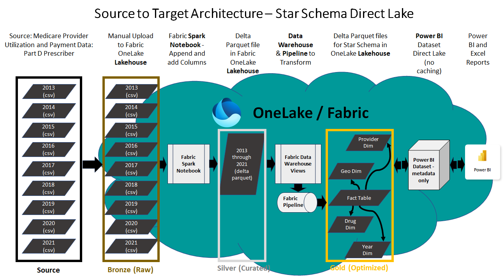

# 220M+ row Star Schema Fabric Power BI Direct Lake Dataset designed with Fabric Data Warehouse and a Pipeline

## Scenario
Another solution in this Git repo in the folder **analytics_bi_directlake** enabled the ingestion of 220+ million rows of data from CMS into a Fabric Lakehouse using Spark Notebooks. The data was transformed into a normalized table in the Lakehouse, and a Power BI dataset in Direct Lake mode was built on top of it. The solution can be found at this link: https://github.com/isinghrana/fabric-samples-healthcare/tree/main/analytics-bi-directlake 

This new solution takes you a step further by transforming that normalized table of data into a star schema design that is optimized for complicated analytic queries and fast query performance. The normalized table of CMS data is redesigned as dimensions and a fact table using the Fabric Warehouse, and then a Fabric Pipeline (Azure Data Factory in Fabric) is used to orchestrate writing the dimensions and fact table to a Fabric Lakehouse. Instructions are then provided for creating a new Power BI dataset in Direct Lake mode that uses the star schema design in the Fabric Lakehouse.

The Fabric Direct Lake connector is a new technology for querying delta parquet files from Power BI without data caching or an intermediary relational database. Power BI datasets have been modernized so that the semantic layer containing metadata and query logic can directly query the Fabric Data Lake. Data for the demo is 220M+ rows of real healthcare data from the open data database titled **Medicare Part D Prescribers - by Provider and Drug**. Link here: https://data.cms.gov/provider-summary-by-type-of-service/medicare-part-d-prescribers/medicare-part-d-prescribers-by-provider-and-drug 

## Scope
This demo is intended to provide experience with creating a star schema design for a Power BI Direct Lake dataset. You will lear how to design dimension and fact tables in the Fabric Data Warehouse, and then write the new tables to a Fabric Data Lakehouse gold layer for use with the Direct Lake Power BI dataset.  

 

### Pre-Requisite
Fabric enabled Workspace is the pre-requisite to be able to setup and end to end demonstration in your own environment. The instructions below are combination of SQL statements, a Fabric Pipeline, and a Power BI Direct Lake dataset.

### Complete the ingestion and initial prep of the data
Complete the solution in this Git repo which ingests and preps the CMS data. The steps can be found at this link: https://github.com/isinghrana/fabric-samples-healthcare/tree/main/analytics-bi-directlake 

### Create Warehouse and add SQL scripts
A video that walks you through the steps below can be accessed at this link.

1. Open up your Fabric Workspace and switch to Data Engineering persona using the menu on bottom left corner
2. Create a new Warehouse or use an existing one. Examples in this repo will use the name **CMS_Warehouse**
3. Click the **+ Warehouses** button and select the Lakehouse containing the flattened table of CMS data. Examples in this repo refer to the name **CMS_Lakehouse**
4. Create a new SQL view for each of the scripts linked below in this repo. Follow the numeric order in the titles of the scripts:
   - **01_dim_Year.sql** - https://github.com/gregbeaumont/fabric-samples-healthcare/blob/main/analytics-bi-directlake-warehouse-starchema/01_dim_Year.sql
   - **02_dim_Drug.sql** - https://github.com/gregbeaumont/fabric-samples-healthcare/blob/main/analytics-bi-directlake-warehouse-starchema/02_dim_Drug.sql
   - **03_dim_Geography.sql** - https://github.com/gregbeaumont/fabric-samples-healthcare/blob/main/analytics-bi-directlake-warehouse-starchema/03_dim_Geography.sql
   - **04_dim_Provider.sql** - https://github.com/gregbeaumont/fabric-samples-healthcare/blob/main/analytics-bi-directlake-warehouse-starchema/04_dim_Provider.sql
   - **05_cms_provider_no_null_key.sql** (replaces empty key fields with "missing") - https://github.com/gregbeaumont/fabric-samples-healthcare/blob/main/analytics-bi-directlake-warehouse-starchema/05_cms_provider_fact_no_null_key.sql
   - **06_cms_provider_fact_star.sql** - https://github.com/gregbeaumont/fabric-samples-healthcare/blob/main/analytics-bi-directlake-warehouse-starchema/06_cms_provider_fact_star.sql 

### Create Pipeline and set up Warehouse SQL views to populate Lakehouse tables
A video that walks you through the steps below can be accessed at this link.

At the time of writing this documentation, it is not posible to upload or paste the JSON from a Pipeline into Fabric to create a new Pipeline. Once that capabilitiy is added, sample code will replace these manual steps in this repo.

1. From the Workspace select **+New** > **Show all** > **Data pipeline**
2. Name the pipeline and select **Add** > **Copy data**
3. Rename the **Copy data** activity to **Write Year Dim**
4. Change the source to the Workspace's Fabric Warehouse table **dbo.cms_dim_year**
5. Change the destination to the Workspace's Fabric Lakehouse Tables and name it **cms_provider_dim_year**
6. Import and validate the schema for the Mapping
7. Select **Add** > **Copy data** and begin the process in steps 3-6 above of adding separate activities for all of the SQL views you created in the Warehouse:
 
 | Activity name | Warehouse Source table (SQL view) | Lakehouse Destination table (delta parquet) | 
 | ------------- | --------------------------------- | ------------------------------------------- | 
 | Write Year Dim | dbo.cms_dim_year | cms_provider_dim_year | 
 | Write Geo Dim | dbo.cms_provider_dim_geography | cms_provider_dim_geography | 
 | Write Provider Dim | dbo.cms_provider_dim_provider | cms_provider_dim_provider | 
 | Write Drug Dim | dbo.cms_provider_dim_drug | cms_provider_dim_drug | 
 | Write CMS Provider Fact | dbo.cms_provider_drug_costs_star | cms_provider_drug_costs_star | 

8. For each of the activities that are for dimensions, drag the **On success** green check and drop on the activity for **Write CMS PRovider Fact**
9. Your Fabric pipeline should look as follows:

