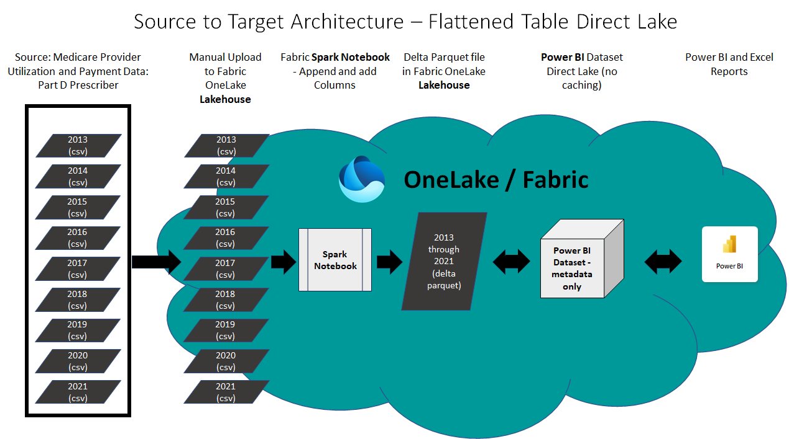

# Direct Lake Connector with 220M+ Rows

## Scenario
The Fabric Direct Lake conenctor is a new technology for querying delta parquet files from Power BI without data caching or an intermediary relational database. Power BI datasets have been modernized so that the semantic layer containing metadata and query logic can directly query the Fabric Data Lake. Data for the demo is 220M+ rows of real healthcare data from the open data database titled **Medicare Part D Prescribers - by Provider and Drug**. Link here: https://data.cms.gov/provider-summary-by-type-of-service/medicare-part-d-prescribers/medicare-part-d-prescribers-by-provider-and-drug 

## Scope
This demo is intended to provide experience with using the Direct Lake connector in Power BI to query large volumes of real data. The demo is not intended to represent the best possible arhitecture for the data model, or the best method to architect the delta parquet portion of the design. The demo will be updated in future interations to include a dimensional model, but the first version will be a simple flattened delta parquet table that can be queried directly from Power BI. 

Tutorial follows similar walkthrough experience as the tutorial in [public docuemntation](https://learn.microsoft.com/en-us/fabric/data-science/tutorial-data-science-introduction)

 

### Upload the Raw Data files to OneLake
1. Download the files from CMS at the following link: 
2. Unzip the files on your local machine.
3. Upload the files to the Files section of a Fabric Lakehouse using the web interface.
4. A video walking you through these steps can be found here: Click Here

### Add Custom Columns and Append the csv files into a Delta Parquet file of the Fabric Lakehouse using a Spark Notebook
1.  . Note that sometimes you may need to refresh the page to display it in GitHub.
2. Copy the Spark Notebook to Fabric and run it.
3. A video walking you through these steps can be found here: Click Here

### Create the Direct Lake Power BI Dataset with DAX expressions and metadata
**Right now the easiest option for Git users is to manually create the Power BI Dataset. An autmoated option will be added when it becomes available in a way that is simple for end users.**
1. From the Fabric Lakehouse web interface, click "New Power BI dataset" per the instructions at this link: 
2. A video walking you through these steps can be found here: Click Here

7. [Explore and Pre-Process Data](./02-data-analysis-preprocess.ipynb)
8. [Train and Registry Machine Learning Prediction Model](./03-Train-Register-DiabetesPredictionModel.ipynb) 
9. [Perform Batch Predictions on simliuation data](./04-Perform-Diabetes-Batch-Predictions.ipynb)
