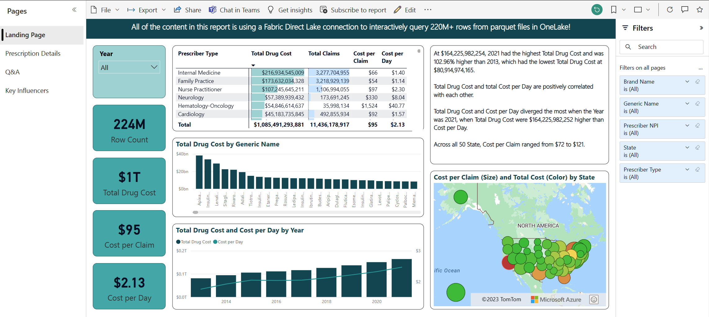
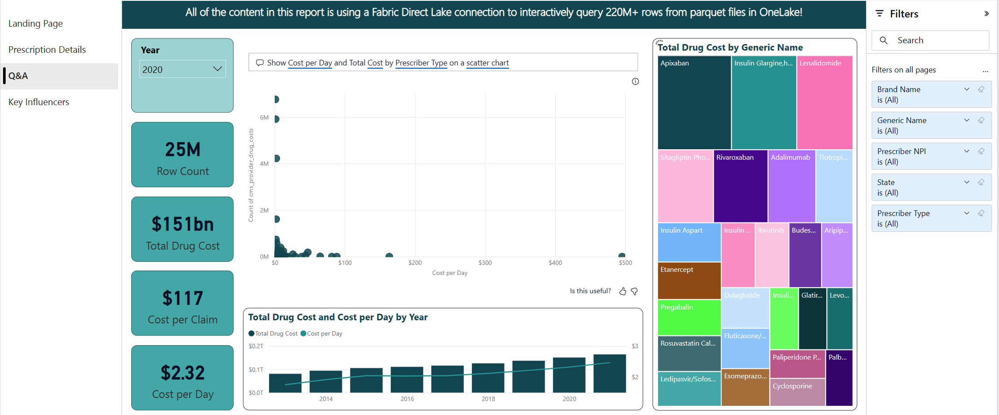

# Fabric Power BI Direct Lake Connector with 220M+ Rows

## Scenario
The Fabric Direct Lake conenctor is a new technology for querying delta parquet files from Power BI without data caching or an intermediary relational database. Power BI datasets have been modernized so that the semantic layer containing metadata and query logic can directly query the Fabric Data Lake. Data for the demo is 220M+ rows of real healthcare data from the open data database titled **Medicare Part D Prescribers - by Provider and Drug**. Link here: https://data.cms.gov/provider-summary-by-type-of-service/medicare-part-d-prescribers/medicare-part-d-prescribers-by-provider-and-drug 

## Scope
This demo is intended to provide experience with using the Direct Lake connector in Power BI to query large volumes of real data. The demo is not intended to represent the best possible arhitecture for the data model, or the best method to architect the delta parquet portion of the design. The demo will be updated in future interations to include a dimensional model, but the first version will be a simple flattened delta parquet table that can be queried directly from Power BI. 

Tutorial follows similar walkthrough experience as the tutorial in [public docuemntation](https://learn.microsoft.com/en-us/fabric/data-science/tutorial-data-science-introduction)

 

### Upload the Raw Data files to OneLake
1. Download the files from CMS, one zip file for each year of data, at the following link: [Click Here](https://data.cms.gov/provider-summary-by-type-of-service/medicare-part-d-prescribers/medicare-part-d-prescribers-by-provider-and-drug)
2. Unzip the files on your local machine.
3. Upload the files to the Files section of a Fabric Lakehouse using the web interface.
4. A video walking you through these steps can be found here: Click Here

### Add Custom Columns and Append the csv files into a Delta Parquet file of the Fabric Lakehouse using a Spark Notebook
1. [Click Here to Access the Spark Notebook](./Load%20CMS%20Medicare%20Part%20D%20Data.ipynb) . Note that sometimes you may need to refresh the page to display it in GitHub.
2. Copy the Spark Notebook to Fabric and run it.
3. A video walking you through these steps can be found here: Click Here

### Create the Direct Lake Power BI Dataset with DAX expressions and metadata
**Right now the easiest option for Git users is to manually create the Power BI Dataset. An automated option will be added when it becomes available in a way that is simple for end users.**
1. From the Fabric Lakehouse web interface, click "New Power BI dataset" per the instructions at this link: [Click Here](https://learn.microsoft.com/en-us/power-bi/enterprise/directlake-overview#to-create-a-basic-direct-lake-dataset-for-your-lakehouse)
2. Add the following DAX espressions by clicking "New measure" in the edit Data Model view:

 | Measure name | DAX Syntax | Format | Percentage Format | Thousands seperator | Decimal places | Data category | 
 | ------------ | ---------- | ------ | ----------------- | ------------------- | -------------- | ------------- |
 | Brand Name Count | `Brand Name Count = DISTINCTCOUNT([Brand Name])` | Whole Number | NO | Yes | 0 | Uncategorized | 
 | Prescriber Count | `Prescriber Count = DISTINCTCOUNT([Prescriber NPI]`) | Whole Number | NO | Yes | 0 | Uncategorized | 
 | Row Count | `Row Count = COUNTROWS('cms_provider_drug_costs')` | Whole Number | NO | Yes | 0 | Uncategorized | 
 | Total Claims | `Total Claims = SUM(cms_provider_drug_costs[Tot_Clms])` | Whole Number | NO | Yes | 0 | Uncategorized | 
 | Total Day Supply | `Total Days Supply = SUM([Tot_Day_Suply])` | Whole Number | NO | Yes | 0 | Uncategorized | 
 | Total Drug Cost | `Total Drug Cost = SUM([Tot_Drug_Cst])` | Currency | NO | Yes | 0 | Uncategorized | 
 | Cost per Claim | `Cost per Claim = DIVIDE([Total Drug Cost],[Total Claims])` | Currency | NO | Yes | 0 | Uncategorized | 
 | Cost per Day | `Cost per Day = DIVIDE([Total Drug Cost],[Total Days Supply])` | Currency | NO | Yes | 2 | Uncategorized | 
 | Days per Claim | `Days per Claim = DIVIDE([Total Days Supply],[Total Claims])` | Decimal | NO | Yes | 1 | Uncategorized | 
  
3. Modify the following metadata changes to columns (that already exist in the dataset):

| Column name | DAX Syntax | Format | Percentage Format | Thousands seperator | Decimal places | Data category | 
 | ---------- | ---------- | ------ | ----------------- | ------------------- | -------------- | ------------- |
 | City | Text | N/A | N/A | N/A | City | 
 | City State | Text | N/A | N/A | N/A | Place | 
 | Prescriber NPI | Whole Number | NO | Yes | 0 | Uncategorized | 
 | State | Text | N/A | N/A | N/A | State or Province | 
 | Year | Whole Number | NO | Yes | 0 | Uncategorized | 

4. The Power BI dataset now exists within Fabric, no caching or refreshing needed! You can go back to your Workspace and re-name the dataset, which shows up as a new artifact in the Fabric Workspace. Or, you can click "New report" and move to the next step.
5. A video walking you through these steps can be found here: Click Here

### Create Reports using Power BI or Connect using Excel
**Right now the easiest option for Git users is to create your own reports. An automated option with a PBIX or PBIT file will be added when it becomes available in a way that is simple for end users.**

1. You can create a new Power BI report in Fabric by either clicking "New report" in the Data model view, clicking "Create report" from the ellipse in the Workspace view of the dataset, or by connecting to the Fabric Lakehouse using Power BI Desktop.
2. You can also use "Analyze in Excel" from the ellipse next to the dataset in the Fabric Workspace.
3. A video walking you through these steps can be found here: Click Here

 

 
