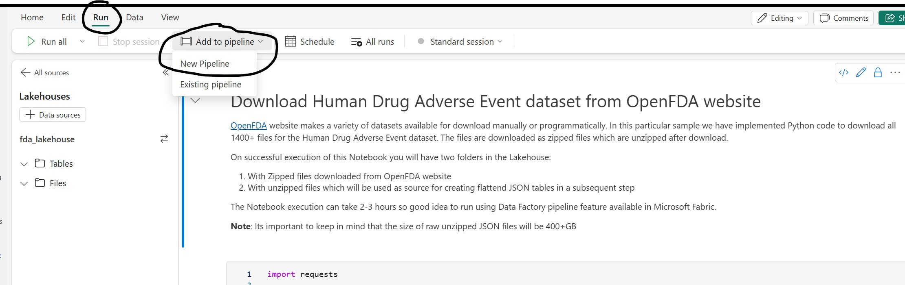
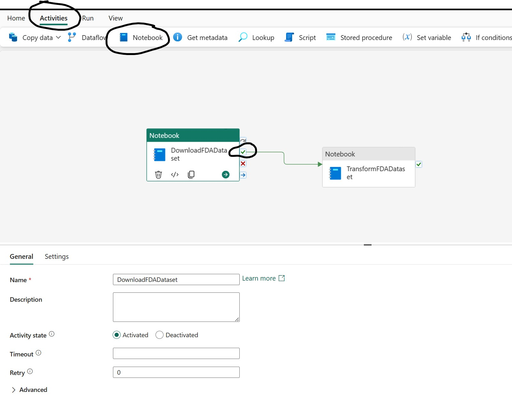
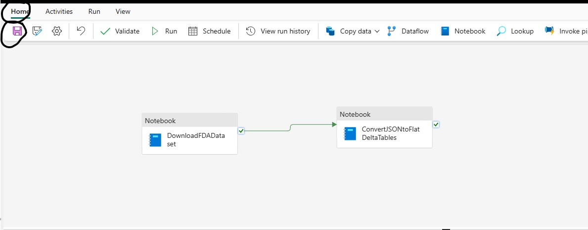

## Create Pipeline to ingest and build Drug Adverse Event Dataset into flattened Relational Tables

In this step you will create a Data Pipeline to execute the previously imported Spark Notebooks

1. Open **01-FDA-Download-DrugEvent-Dataset** Notebook
2. Open the *Run* options by clicking **Run** button in the toolbar 
3. Clck **Add to Pipeline** button and select **New Pipeline** option
   
    

4. Specify appropriate name for the Pipeline example *fda_ds_silver_pipeline* and click Create button to open Data Pipeline canvas
5. Select the Notebook Activity on canvas to give appropriate name like *DownloadFDADataset* to the Activity as shown in the screenshot below, also review the Settings Tab for activity (Workspace and Notebook settings are automatically set appropriately because Pipeline was created from Notebook)
   
    

6. Open the *Activity* menu by clicking **Activity** button in the Toolbar
7. Click **Notebook** button which will add a new Notebook activity on the canvas
   
    
    
8. Select the new Notebook Activity on the canvas and open Settings section
   
   

9.  Set the Workspace value to the current Workspace
10. Set the Notebook value to **02-FDA-DrugEvent-CreateSilverTables**
11. Connect the two Activities by dragging from the Download Activity On Success icon to the Transform Activity added for second Notebook
   
    

12. Make sure to save changes to the Pipeline

***

[Home](../Readme.md) | [Prevous](./01-CreateLakehouse-SetupNotebooks.md) | [Next](./03-RunPipeline.md)