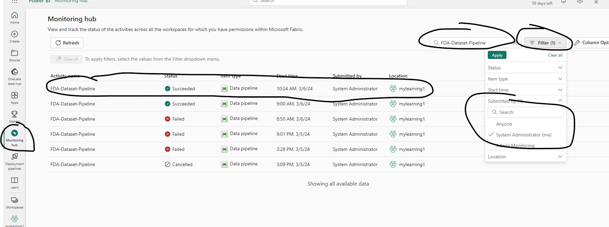
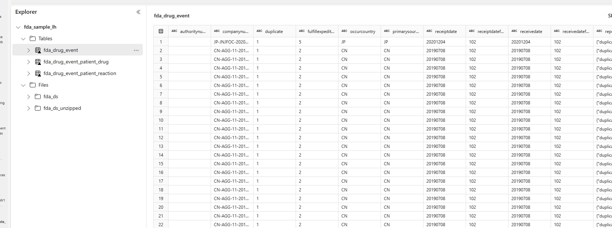

## Run Pipeline to generate flattened relation tables in Silver Layer of Medallion Architecture

In this step you will run the Pipeline created in Step 2. The Pipeline job can take a few hours to execute so you can kick off the Pipeline execution and check back after a few hours to see the execution status. Pipeline will execute in the background and there is no need to keep your Microsoft Fabric session open.

1. Make sure you have saved Pipeline changes and then click the **Run** button from Home menu as shown in the screenshot below

2. It will take the Pipeline Job a few hours to run and you can monitor execution status of the job from Monitoring Hub, screenshot below shows successful run of the Pipline Job

***

Once the Job completes successfully you can browse to the Lakehouse to see the three tables as well as two folders in the files section of Lakehouse for zipped and unzipped raw files as shown in the screenshot below.

**Dataset Size Information**

* Raw Unzipped JSON File size on disk: 400+ GB, 1400+ Files
* Total Flattened Table size on disk (delta parquet are significantly compressed by their nature): 15-20 GB
* Three Delta Tables 
    * fda_drug_event Table - 17 Million+ Rows; Size 750 MB
    * fda_drug_event_patient_reaction Table - 50 Million+ Rows; Size 17 GB+ (1 to many from Drug Event table) 
    * Fda_drug_event_patient_drug Table - 62 Million+ Rows; Size 250 MB (1 to many from Drug Event table)

***

[Home](../Readme.md) | [Prevous](./02-CreatePipeline.md) | [Next](./04-CreateWarehouse.md)

