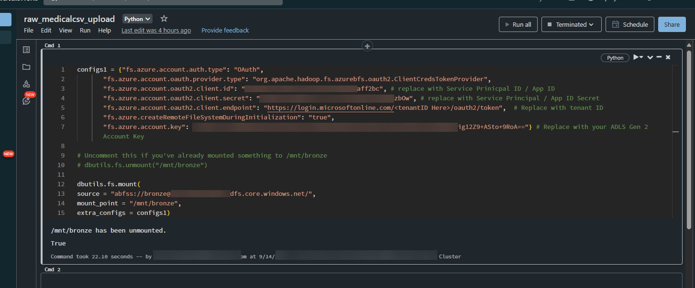
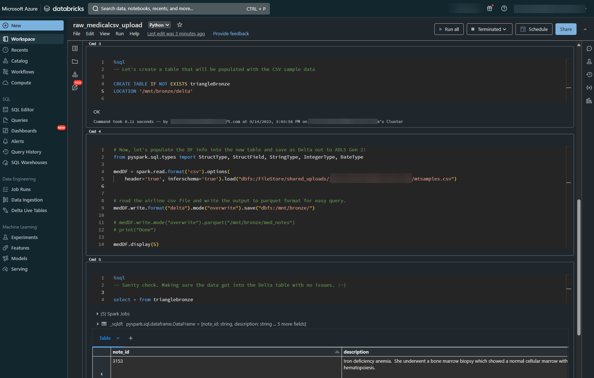
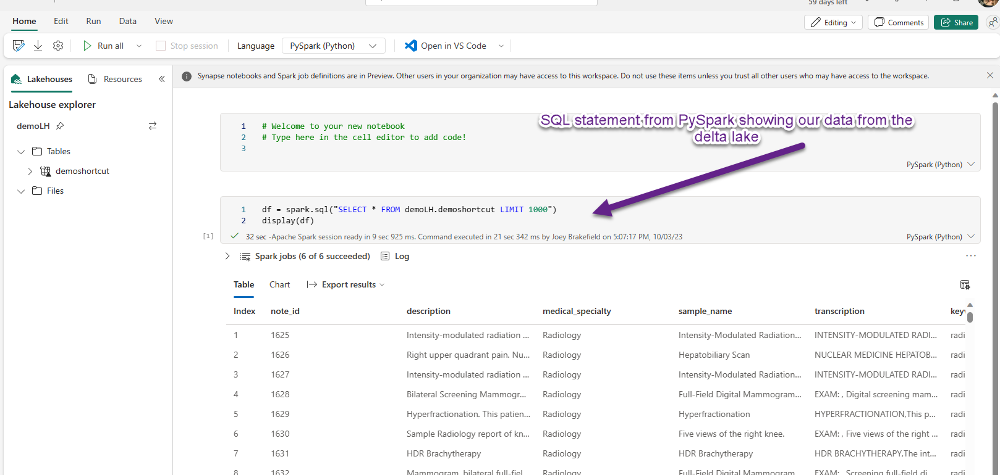
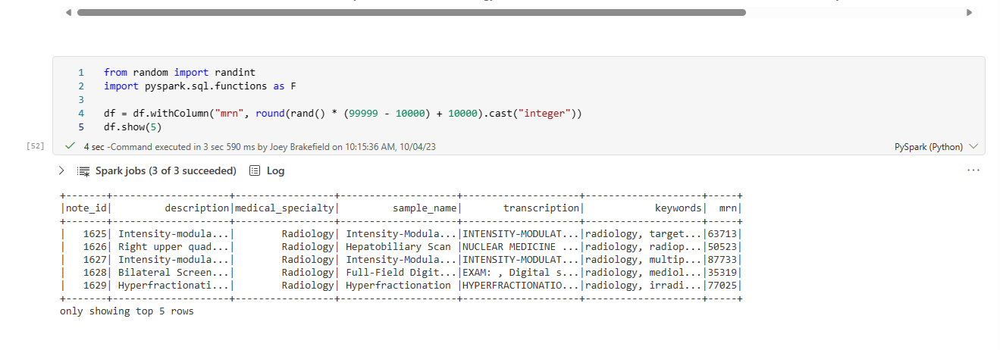

# End to End Azure Databricks, Microsoft Fabric, and Power BI Clinical Notes Walkthrough

In this guide, you'll find how to build out a demo Delta Lake originating in Azure Databricks, shortcutting that Delta Lake to Microsoft Fabric, make changes in Fabric that are reflected in Delta Lake, and create a simple AI-driven Power BI dashboard!

## Building out the Delta Lake in Azure Databricks

1. [Setup](https://learn.microsoft.com/en-us/azure/databricks/getting-started/#--create-an-azure-databricks-workspace) or use and existing Azure Databricks workspace.

2. Initialize your Azure Databricks cluster with general compute notes as the workers.
   

3. Create an Azure App Registration/Service Principal for this effort and ensure it has [Storage Blob Data Contributor](https://learn.microsoft.com/en-us/azure/role-based-access-control/built-in-roles#storage-blob-data-contributor) rights on the storage account in which you are wanting to create the Delta Lake.

   Record the secret at creation time as you'll use it in the next portion

4. Upload the .dbc file notebook in this repository folder to run through creating a Delta Lake. Use the newly created cluster to execute the notebook after making these modifications:

   1. Update the first cell of the notebook with your credentials for:
      Tenant Id inserted in to the login.microsoftonline.com URI, Service Prinicpal ID/App ID, Service Prinicpal Secret & the Azure Storage Account Key where you want your lake. Basically, all the blurred spots in the image below

      

   2. Either upload the .csv sample file to the DBFS local store or reference it /mnt/bronze/<path you chose on ADLS Gen 2>. In my example, I just uploaded the sample file to the Databricks workspace's DBFS store. Run the second cell and it will select the top 5 records for the dataframe to ensure you've correctly configured it.

      

   3. In the next two cells, we're going to create an empty table and load the data from the dataframe in Step 2 into that table. We're writing that out to the ADLS Gen 2 account that was configured in Step 1.

      

   4. Alright, you've got data in delta lake! Congrats. You can pull up Azure Storage Explorer to confirm delta files are in the location before we switch to Fabric to continue the demo.

## Connecting to the Delta Lake in Fabric

1. Navigate to the [Fabric portal](https://fabric.microsoft.com) and navigate to the Data Engineering persona [using these docs as guidance](https://learn.microsoft.com/en-us/fabric/data-engineering/create-lakehouse) 

2. Once you've created a new lakehouse -- here I'm using "demoLH" as my lakehouse, make sure you "shortcut" your existing Databricks-created Delta Lakehouse into Fabric by [following these steps](https://learn.microsoft.com/en-us/fabric/data-engineering/lakehouse-shortcuts). 

   

   - NOTE #1: Make sure to specify the DFS endpoint "https://yourStorageAccount.dfs.core.windows.net"

   - NOTE #2: Make sure to specify the container 

3. Now that your table is registered as a shortcut, you can click on it and notice there is no column named "mrn"

   

## Updating the Delta Lake

1. Now, we're going to modify the table by first loading the table into a dataframe. Right-click the shortcut delta table, then select "New Notebook".

2. Once the new notebook opens, you'll right-click the table again and select "Load" and Fabric will write the first bits of code for you:

   

   

   

6. Now, let's modify the table and make sure both Azure Databricks and Fabric see the change ok.

   1. Create a new column called **mrn**  and populate it with some random integers:

      

   2. Now, let's write the new column with new random values out to our delta lake so that we can see the changes in both Fabric and Azure Databricks:

      

   3. And finally, let's make sure that the data is reflected in the delta lake on Azure Databricks:
      

## Creating an automatic Power BI Dashboard in Fabric

1. We're going to start with creating a new Power BI dataset from the "Data Engineering" Persona and clicking **New Power BI dataset**.

   

2. Now, let's select our table:

   

3. And make sure that "mrn" is added to the dataset. While we're here, let's remove the aggregation since Power BI detected it was an integer value column from our Data Science work:

   

4. Go back to your workspace and select the dataset you just created and you'll be presented with the following screen. Select down chevron on the **+ Create a report** button and select Auto-create. 

   

5. Alright, let's look at the final Power BI report to ensure that the auto-generated report looks interesting and make any tweaks if we need to. Typically, I've found the auto-created reports are pretty great at summarization of the useful columns in a report. For more info about adjusting the auto-created report, [click here](https://learn.microsoft.com/en-us/power-bi/create-reports/service-quick-create-report).

   # Conclusion

   Alright, that's a wrap. Remember to delete either individual artifacts or the entire workspace. If you have questions about Microsoft Fabric, remember to check the awesome [always-updating tutorials on Microsoft Learn](https://learn.microsoft.com/en-us/fabric/get-started/end-to-end-tutorials). Happy Fabric-ing!

   
