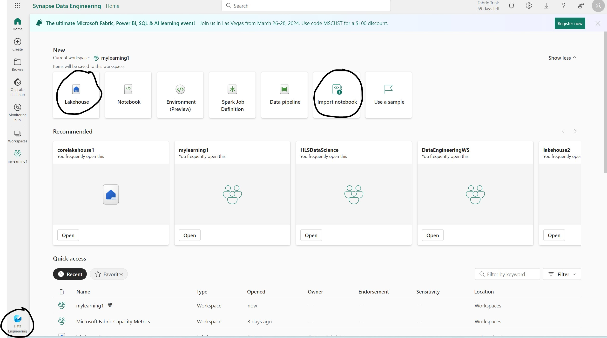
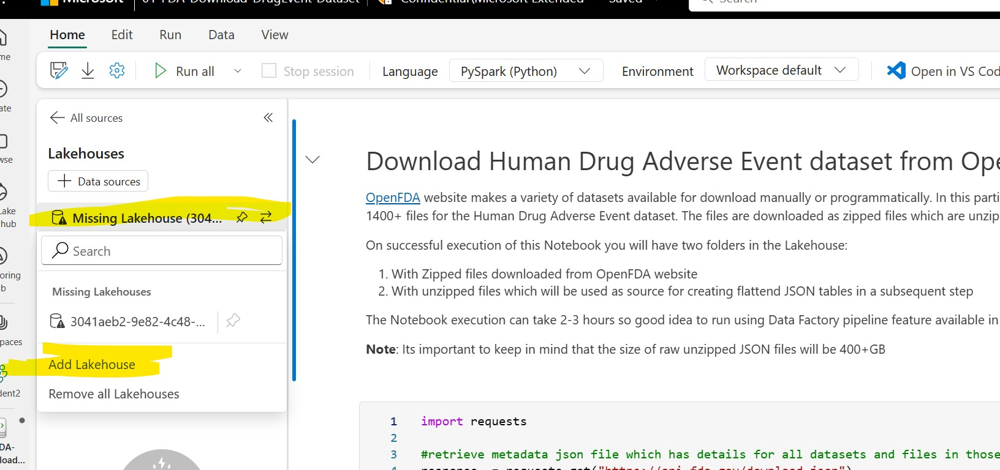

## Create Lakehouse, import Spark Notebooks and setup the Lakehouse association for Spark Notebooks

In this step you will setup Lakehouse and Notebooks for downloading dataset to Files section of the Lakehouse

1. Open your Fabric Workspace and switch to Data Engineering persona using the menu on bottom left corner (the screenshot below shows the buttons for Lakehouse creation and Notebook Import for Steps 2 and 3) 
   
        

2. Create a new Lakehouse with an appropriate name (example *fda_drugadverse_events_lh*) if not using an existing Lakehouse

3. Open [01-FDA-Download-DrugEvent-Dataset](../01-FDA-Download-DrugEvent-Dataset.ipynb) Spark Notebook and download to local machine using the *Download Raw File* button on the top right corner as shown in the screenshot below

    

4. Repeat download step for [02-FDA-DrugEvent-CreateSilverTables](../02-FDA-DrugEvent-CreateSilverTables.ipynb) Spark Notebook

5. Import the two downloaded Notebooks into Fabric Workspace (screenshot in Step 1 for *Import Notebook* button)

6. Open **01-FDA-Download-DrugEvent-Dataset** Notebook, once the import is successful **fix the Lakehouse association of the Notebook** by first clicking **Remove All Lakehouses** button then adding the Lakehouse created in Step 2 using **Add Lakehouse** button
    
    

7. Repeat Step 5 for **02-FDA-DrugEvent-CreateSilverTables** Notebook

***

**Note**:

**01-FDA-Download-DrugEvent-Dataset** Spark Notebook has the code to download and unzip all 1400+ dataset files. The openFDA website makes available metadata for all datasets in a JSON which is parsed by the Notebook code to identify and download the Human Drug Adverse event dataset files. The following screenshots shows the metadata file whichis available at the link https://api.fda.gov/download.json but no need to download as the link is shared here for reference purpose only.

**02-FDA-DrugEvent-CreateSilverTables** Spark Notebook uses raw JSON files (downloaded using the first Spark Notebook) as source and creates flattened tables more conducive for downstream consumption (reporting and analytics).

Both Notebooks have markdown cells as well as inline comments to describe the code for better understanding of the solution. At this point you are ready to move onto the next step of creation of Data Pipeline to run these Notebooks as a non-interactive job.

***

[Home](../Readme.md) | Prevous | [Next](./02-CreatePipeline.md)
