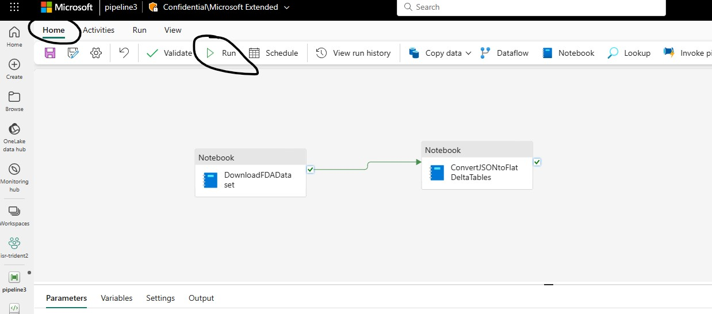

## Run Pipeline to generate flattened relation tables in Silver Layer of Medallion Architecture

[Prevous](./02-CreatePipeline.md) | Next

In this step you will run the Pipeline created in Step 2. The Pipeline job can take a few hours to execute so you can kick off the Pipeline execution and check back after hours to see the execution status, it will execute in the background and there is no need to keep your Microsoft Fabric session open.

1. Make sure you have saved Pipeline changes and then click the **Run** button from Home menu as shown in the screenshot below

2. It will take the Pipeline Job a few hours to run and you can monitor execution status of the job from Monitoring Hub, screenshot below shows successful run of the Pipline Job

Once the Job completes successfully you can browse to the Lakehouse to see the three tables as well as two folders in the files section of Lakehouse for zipped and unzipped raw files as shown in the screenshot below.

[Prevous](./02-CreatePipeline.md) | Next

