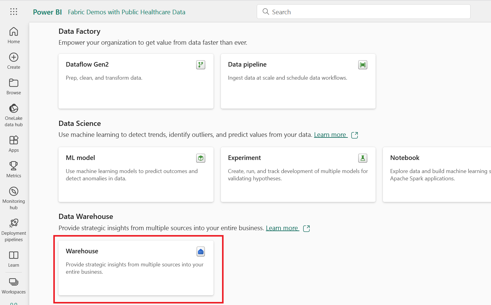
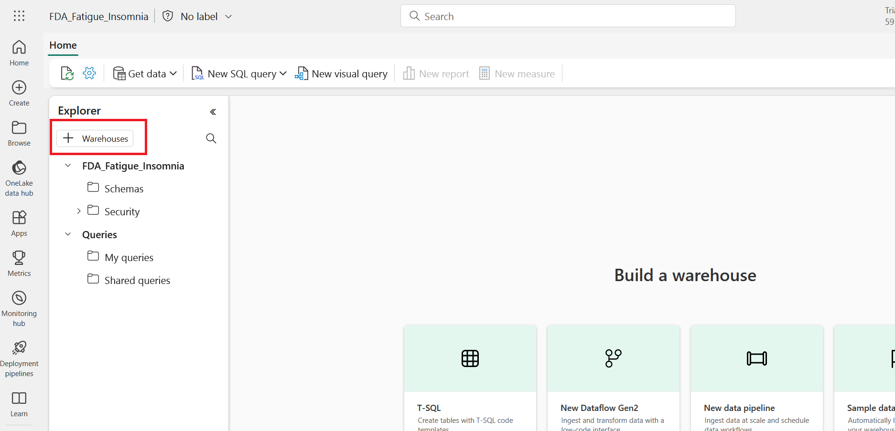
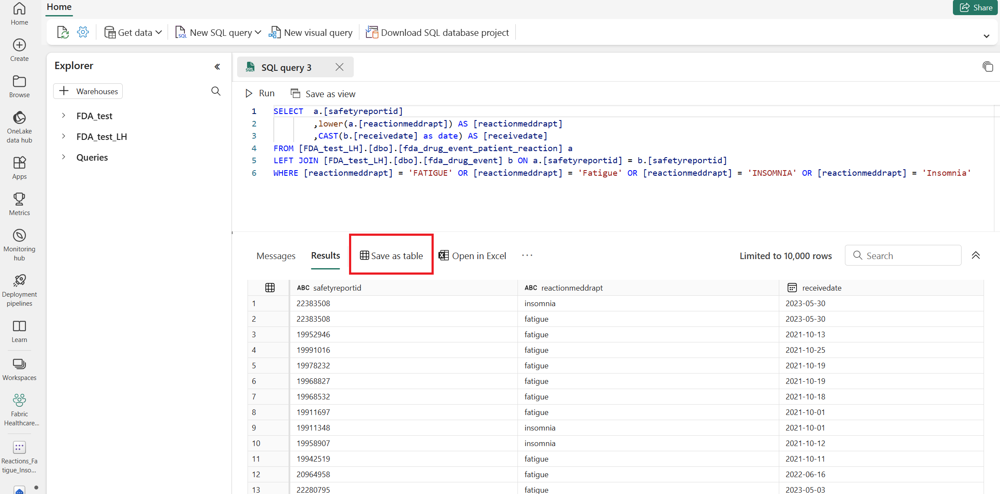
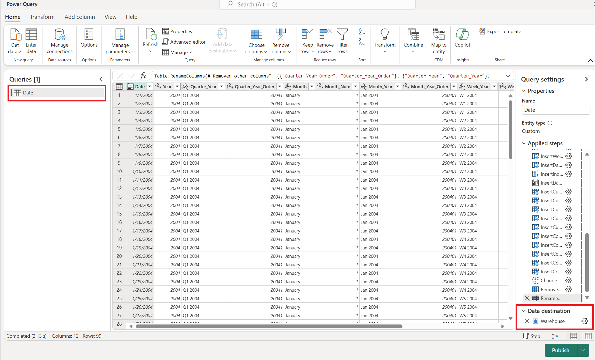
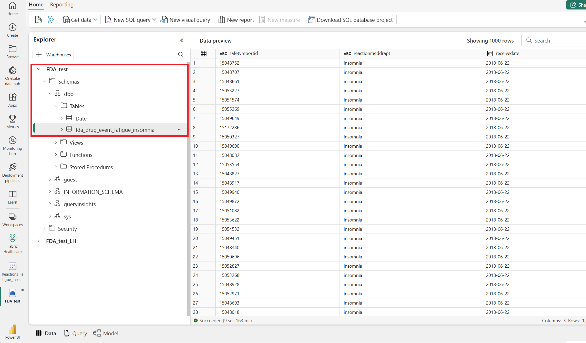

## Create Fabric Warehouse to serve as a Gold layer data mart

Now you will create a Fabric Warehouse that will serve as a Gold layer for reporting. The premise for this Gold layer is that an analyst with SQL and Power BI skills was asked to report on the frequency of reports containing the reactions 'Fatigue' or 'Insomnia.' This use case is very simple, and only serves to provide you with a framework for developing your own unique use cases and data marts.

1. From your Fabric Workspace select **New** > **More options** > **Warehouse** as seen in the screenshot below:

2. Name the Warehouse as you choose, and select **+Warehouses** as seen below:

3. Select your Lakehouse and press **Confirm** as seen below:

4. From the top ribbon of the Warehouse, select **New SQL query** > **New SQL query**.
5. Paste in the SQL query linked here: [03-SQL-CreateWarehouseTable.sql](./scripts/03-SQL-CreateWarehouseTable.sql). Notice that the script accounts for discrepencies in capitalization. Make sure you replace the names of your Lakehouse where the query specifies **YOURLAKEHOUSENAME**
6. Select **Run**, and the query shouldn't take long to complete. Highlight the SQL Query and select **Save as table** as seen below:

7. Give the new Warehouse table a name, I used **fda_drug_event_fatiue_insomnia** as seen below:

8. Hit **OK** to process the table and write it to the Warehouse. 

Now you will add a Date table to the Warehouse. The Date table will simplify aggegating by week, month, quarter, and year at the reporting level. Dataflows Generation 2 will be used to create a simple Date table in the Warehouse:

1. From your Fabric Workspace select **New** > **More options** > **Dataflows Gen 2**
2. Select **Get Data** > **Blank query**
3. Copy the code from this repo at this link and paste it: [DateTable.m](./scripts/DateTable.m). Click **Next**
4. Change the name of the query to **Date** and change the Data Destination to your Warehouse per the screenshot below:

5. Select **Publish** and the Date table will write to your Warehouse. You should now have a Gold layer Warehouse ready for SQL queries or to build a Direct Lake Semantic Model that can be used with Power BI!:

6. Now you can explore the OpenFDA data using SQL in the Warehouse. New specialized scripts from the Lakehouse can be materialized in the Warehouse for specialized analysis. You can also create views, or bring in new data from other sources to enrich your analytics.

[Home](../Readme.md) | [Prevous](./03-RunPipeline.md) | [Next](./05-CreateDirectLake.md)

